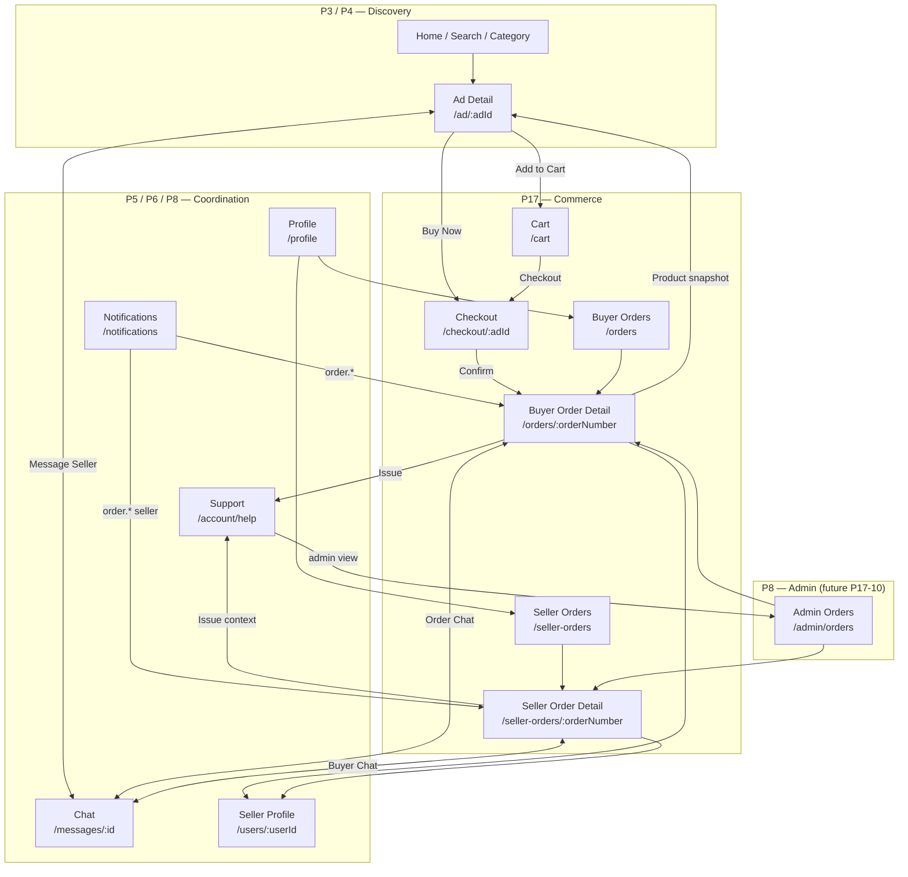

# P17-4-NAV — Commerce Navigation Contract

| Field | Value |
|-------|-------|
| **Domain** | P17 — Commerce, Orders & Fulfillment |
| **Phase** | **P17-4-NAV** — Navigation Contract (documentation only) |
| **Status** | **Active — binding contract for P17-4+ implementation** |
| **Horizon** | 10–50 year marketplace — millions of orders, notifications, and cross-surface navigation events |
| **Runtime impact** | **None** — no API, no DB, no UI, no deploy |

**Parent charter:** [P17-commerce-orders.md](./P17-commerce-orders.md)  
**Domain spec:** [P17-2-order-domain-spec.md](./P17-2-order-domain-spec.md)  
**UX reference:** [P17-1-ux-spec.md](./P17-1-ux-spec.md)  
**Workers (future fan-out):** [P15-background-jobs.md](./P15-background-jobs.md)

---

## Purpose

Define the **binding navigation contract** for Souq Arab EU commerce: how users move between Ad, Checkout, Orders, Chat, Support, Notifications, Profiles, and Admin — without dead ends, false affordances, or isolated silos.

**Problem statement (audit conclusion):** P17 schema, mock API, and UI shells exist, but commerce surfaces are **not wired as a network**. This document is the prerequisite for P17-4 (Orders API Layer) and all downstream P17 phases.

**Explicit rule:** No P17-4 implementation (API, DB writes, UI wiring) may start until **P17-4-NAV is closed** (this doc + index + PROJECT_STATE sync + Mohamed sign-off).

---

## 1. Commerce Network Architecture

### 1.1 Canonical surfaces

| Surface | Route (target) | Owner | Role in network |
|---------|----------------|-------|-----------------|
| Ad Detail | `/ad/:adId` | **P4** | Discovery + commerce entry (Buy Now / Add to Cart / Message) |
| Cart | `/cart` | **P17** | Multi-item staging (v1: optional; v2: full cart) |
| Checkout | `/checkout/:adId` | **P17** | 3-step wizard → Order Summary Preview → confirm |
| Buyer Orders Hub | `/orders` | **P17** | List + tabs + stats |
| Buyer Order Detail | `/orders/:orderNumber` | **P17** | Timeline, actions, cross-links |
| Seller Orders Hub | `/seller-orders` | **P17** | Seller queue + tabs |
| Seller Order Detail | `/seller-orders/:orderNumber` | **P17** | Confirm / prepare / ship actions |
| Chat Thread | `/messages/:conversationId` | **P5** | Coordination; order context banner when linked |
| Notifications | `/notifications` | **P6** shell · **P11** delivery | Deep links into order surfaces |
| Support Help | `/account/help` | **P8** shell · user tickets | Order-linked tickets |
| Buyer Profile (self) | `/profile` | **P6** | Orders entry tiles |
| Seller Profile (public) | `/users/:userId` | **P6** | Trust + listings; no order PII |
| Admin Orders | `/admin/orders` (future) | **P8** shell · **P17** rules | Ops, SLA, issues |

**URL identifier for orders:** `order_number` (human-readable, e.g. `SOUQ-2026-001042`) — **not** internal UUID in user-facing URLs. Internal UUID remains API/DB PK only.

### 1.2 Network diagram (target state)



### 1.3 Navigation invariants (never break)

| # | Invariant |
|---|-----------|
| N1 | Every commerce screen has **exactly one primary back target** documented in §2 |
| N2 | Order Detail always exposes **≥2 exit paths**: back to hub + cross-link (chat or ad snapshot) |
| N3 | Notifications for orders **must** deep-link to order detail — never to a dead screen |
| N4 | Chat opened from an order **must** show order context banner with return path |
| N5 | Support tickets created from an order **must** carry `order_number` — never orphan tickets |
| N6 | Guest commerce actions redirect to login with **`?redirect=`** preserving checkout intent |
| N7 | Feature flag off → Buy Now shows **Coming Soon sheet** (current P17-1B) — no `/checkout` route |
| N8 | Feature flag on → Buy Now **must** reach checkout or order — never a sheet-only dead end |
| N9 | Admin order views use **order_number** in URLs for support correlation |
| N10 | Bottom nav does **not** include Orders (hub accessed via Profile) — unchanged until product decision |

### 1.4 Feature flag gates

| Flag (conceptual) | When OFF (default PROD until P17-19) | When ON (STAGING / approved PROD) |
|-------------------|--------------------------------------|-----------------------------------|
| `P17_BUY_NOW_ENABLED` | Coming Soon sheet on Ad Detail | Navigate to `/checkout/:adId` |
| `P17_CART_ENABLED` | Hide Add to Cart OR same Coming Soon | Navigate to `/cart` |
| `P17_ORDERS_HUB_VISIBLE` | Hide Profile order tiles OR show Coming Soon badge only | Full hub + list + detail |
| `P17_ORDER_NOTIFICATIONS` | No order notification types emitted | Full §6 contract |

**Rule:** List surfaces must not show clickable orders until Order Detail is API-connected (P17-5 gate).

---

## 2. Deep Link Matrix

**Legend:** Back = primary back affordance (header ←). Secondary = optional browser/history back.

### 2.1 Discovery → Commerce

| From | To | Trigger | Back behavior |
|------|-----|---------|---------------|
| Home / Search / Category | Ad Detail | Tap ad card | Home / Search / Category (history) |
| Ad Detail | Checkout | Buy Now (flag ON, logged in) | → Ad Detail |
| Ad Detail | Login | Buy Now (guest) | After login → Checkout (`?redirect=/checkout/:adId`) |
| Ad Detail | Cart | Add to Cart (flag ON) | → Ad Detail |
| Ad Detail | Coming Soon sheet | Buy Now / Cart (flag OFF) | Dismiss → Ad Detail |
| Ad Detail | Chat Thread | Message Seller | → Ad Detail (or Messages list if opened from there) |
| Ad Detail | Seller Profile | View profile | → Ad Detail |
| Ad Detail | Support | Report ad (existing P7 flow) | → Ad Detail |

### 2.2 Checkout flow

| From | To | Trigger | Back behavior |
|------|-----|---------|---------------|
| Checkout step 1 (Address) | Checkout step 2 (Shipping) | Continue | → step 1 |
| Checkout step 2 | Checkout step 3 (Summary Preview) | Continue to review | → step 2 |
| Checkout step 3 | Order Created confirmation | Confirm order (`تأكيد الطلب`) | No back to checkout (idempotent guard) |
| Checkout step 3 | Checkout step 1 / 2 | Edit address / Edit shipping links | → respective step |
| Checkout any step | Ad Detail | Header back (before confirm) | → Ad Detail |
| Order Created confirmation | Buyer Order Detail | View order details | → Buyer Orders Hub on header back |
| Order Created confirmation | Chat Thread | Talk to seller | → Order Detail (banner return) |
| Cart | Checkout | Checkout selected item(s) | → Cart |
| Cart | Ad Detail | Tap item row | → Ad Detail |

### 2.3 Buyer orders

| From | To | Trigger | Back behavior |
|------|-----|---------|---------------|
| Profile | Buyer Orders Hub | Orders tile | → Profile |
| Buyer Orders Hub | Buyer Order Detail | Tap order row | → Buyer Orders Hub |
| Buyer Orders Hub | Home | Empty state CTA «تصفح» | → Home |
| Buyer Order Detail | Buyer Orders Hub | Header back | → Buyer Orders Hub |
| Buyer Order Detail | Ad Detail (snapshot) | Product / listing link | → Buyer Order Detail |
| Buyer Order Detail | Chat Thread | Contact seller | → Buyer Order Detail (order banner) |
| Buyer Order Detail | Support Help | Report issue (`?order=:orderNumber`) | → Buyer Order Detail |
| Buyer Order Detail | Seller Profile | Seller name link | → Buyer Order Detail |

### 2.4 Seller orders

| From | To | Trigger | Back behavior |
|------|-----|---------|---------------|
| Profile | Seller Orders Hub | Seller orders tile | → Profile |
| Seller Orders Hub | Seller Order Detail | Tap order row | → Seller Orders Hub |
| Seller Order Detail | Seller Orders Hub | Header back | → Seller Orders Hub |
| Seller Order Detail | Chat Thread | Contact buyer | → Seller Order Detail (order banner) |
| Seller Order Detail | Ad Detail (snapshot) | Listing link | → Seller Order Detail |
| Seller Order Detail | Buyer Profile (limited) | Buyer link (no PII) | → Seller Order Detail |

### 2.5 Cross-domain

| From | To | Trigger | Back behavior |
|------|-----|---------|---------------|
| Notifications | Buyer Order Detail | Tap buyer order notification | → Notifications |
| Notifications | Seller Order Detail | Tap seller order notification | → Notifications |
| Notifications | Ad Detail | Tap ad notification (non-order) | → Notifications |
| Notifications | Support Help | Tap support notification | → Notifications |
| Chat Thread | Ad Detail | Ad thumbnail in header | → Chat Thread |
| Chat Thread | Buyer/Seller Order Detail | Order context banner «عرض الطلب» | → Chat Thread |
| Support Help | Buyer Order Detail | Linked order chip in ticket | → Support Help |
| Support Help | Seller Order Detail | Seller-side ticket (future) | → Support Help |
| Admin Orders list | Admin Order Detail | Row click | → Admin Orders list |
| Admin Order Detail | Admin User Detail | Buyer/seller admin link | → Admin Order Detail |
| Admin Order Detail | Buyer/Seller Order Detail (read-only mirror) | Future ops — same order_number | → Admin Order Detail |

### 2.6 Login redirect preservation

| From | To | Trigger | Back behavior |
|------|-----|---------|---------------|
| Any protected commerce route | Login | Unauthenticated access | After auth → original `redirect` URL |
| Login | Checkout | `?redirect=/checkout/:adId` | Completes checkout intent |

---

## 3. Buyer Journey

### 3.1 Stage map

```
DISCOVER          COMMIT            FULFILL           CLOSE
────────          ──────            ───────           ─────
Home/Search   →   Checkout      →   Awaiting      →   Delivered
     ↓               ↓                 Seller            ↓
Ad Detail     →   Order Created →   Preparing     →   Confirm receipt
     ↓               ↓                 ↓                 ↓
Message (alt)     Order Detail    →   Shipped       →   Completed
```

### 3.2 Full journey with entry/exit points

| Stage | User state | Primary screen | Entry points | Exit points | Key actions |
|-------|------------|----------------|--------------|-------------|-------------|
| **1. Discover** | Browsing | Ad Detail | Home, Search, Category, Chat ad link, Notification (ad), Favorites | Buy Now, Add to Cart, Message, WhatsApp, Seller Profile | Compare, message seller |
| **2. Intent** | Decided to buy | Checkout step 1 | Buy Now from Ad; Cart checkout | Back → Ad; Login gate | Select address |
| **3. Review** | Pre-commit | Checkout step 3 (Summary Preview) | Steps 1–2 | Edit address/shipping; Confirm | `تأكيد الطلب` — **not payment** |
| **4. Order created** | `pending_confirmation` | Confirmation + Order Detail | Confirm CTA | View detail, Chat, Orders hub | Cancel (policy) |
| **5. Awaiting seller** | `pending_confirmation` | Order Detail | Push, Notification, Orders hub | Chat, Cancel, Support (limited) | Wait; SLA visible |
| **6. Confirmed** | `confirmed` | Order Detail | Notification `order.confirmed` | Chat, Timeline | Track progress |
| **7. Preparing** | `preparing` | Order Detail | Notification `order.preparing` | Chat | — |
| **8. Shipped** | `shipped` / transit | Order Detail | Notification `order.shipped` | Tracking link, Chat, Issue (if policy) | View tracking |
| **9. Delivered** | `delivered` | Order Detail | Notification `order.delivered` | Confirm receipt, Issue | Confirm receipt |
| **10. Completed** | `completed` | Order Detail (history) | Auto-complete notification | Ad snapshot, Orders hub, Re-order (future) | — |

### 3.3 Parallel path (always available)

Chat-only deals remain valid (**P5** default). Buy Now is **additive**. From Ad Detail, Message Seller never requires an order. If an order exists for the same ad+buyer, Chat shows order context banner (§5).

### 3.4 Pickup branch (buyer view)

Steps 8–9 collapse: `preparing` → `delivered` (no shipped/in_transit/out_for_delivery). Timeline UI collapses per [P17-2 §5.3](./P17-2-order-domain-spec.md).

---

## 4. Seller Journey

### 4.1 Stage map

```
INTAKE            DECIDE            FULFILL           CLOSE
──────            ──────            ───────           ─────
Notification  →   Accept/Reject →   Preparing     →   Delivered
     ↓               ↓                 ↓                 ↓
Seller Orders →   Order Detail  →   Shipped       →   Completed
```

### 4.2 Full journey with entry/exit points

| Stage | User state | Primary screen | Entry points | Exit points | Key actions (max 3 visible) |
|-------|------------|----------------|--------------|-------------|----------------------------|
| **1. Intake** | New order | Seller Order Detail | Push `order.created`, Seller Orders hub tab «جديد» | Chat, Reject | **Confirm** / **Reject** / **Message** |
| **2. Accepted** | `confirmed` | Seller Order Detail | Notification | Chat | **Start preparing** |
| **3. Preparing** | `preparing` | Seller Order Detail | — | Chat | **Mark shipped** (shipping) or **Ready for pickup** |
| **4. Shipped** | `shipped` | Seller Order Detail | — | Chat, Tracking edit (policy) | Optional transit updates |
| **5. Delivered** | `delivered` | Seller Order Detail | — | Chat, Issue response | Wait for buyer confirm |
| **6. Completed** | `completed` | Seller Order Detail | Notification `order.completed` | Seller Orders hub | — |

### 4.3 Seller UX cap (P17-1)

At any state, **maximum 3 primary actions** visible. Secondary actions (chat, view ad) in overflow or secondary row.

---

## 5. Chat Integration Contract

**Owner:** **P5** owns transport and thread semantics. **P17** owns order↔conversation **link contract**.

### 5.1 Link model (future schema/API)

| Field | Purpose |
|-------|---------|
| `conversation_id` | Existing P5 thread |
| `order_number` | Optional — set when chat opened from order or order created with chat intent |
| `ad_id` | Always present for listing-origin threads |

**Rule:** One conversation may reference **at most one active non-terminal order** per (buyer, ad) pair.

### 5.2 Order Context Banner (required when `order_number` present)

Displayed at top of Chat Thread (below header, above messages):

```
┌─────────────────────────────────────────────────────────┐
│ 📦 طلب SOUQ-2026-001042 · بانتظار تأكيد البائع          │
│ [عرض الطلب ←]                                           │
└─────────────────────────────────────────────────────────┘
```

| Element | Behavior |
|---------|----------|
| Order number + status | Read-only; status from order API cache |
| «عرض الطلب» | Buyer → `/orders/:orderNumber`; Seller → `/seller-orders/:orderNumber` |
| Banner dismiss | **Not allowed** while order is non-terminal — prevents context loss |
| Banner hidden | When no linked order, or order terminal (`completed`/`cancelled`) > 7 days |

### 5.3 Open Chat (from order)

| Actor | From | Action | Result |
|-------|------|--------|--------|
| Buyer | Buyer Order Detail | «تحدث مع البائع» | Open existing conversation for `ad_id` or create via P5; set `order_number` link |
| Seller | Seller Order Detail | «تحدث مع المشتري» | Same |
| Buyer | Order Created confirmation | «تحدث مع البائع» | Same |

**Back path:** Header back on Chat → **Order Detail** (not Messages list) when opened from order. Query param: `?from=order&orderNumber=...` for return routing.

### 5.4 Open Order (from chat)

| Actor | From | Action | Result |
|-------|------|--------|--------|
| Either | Chat banner | «عرض الطلب» | Respective order detail |
| Either | Chat overflow (future) | «الطلبات المرتبطة» | Order detail if single; picker if multiple (future cart) |

### 5.5 System messages (future — P17 + P5)

On status transitions, optional system line in chat: «تم تأكيد الطلب من البائع» — links to order detail. Produced via **P15** fan-out, not sync API.

---

## 6. Notifications Contract

**Producer:** P17 history events → **P15** `order.notification_fan_out` → **P11** delivery.  
**Consumer:** Notifications UI + push deep links.

### 6.1 Entity model

| Field | Value |
|-------|-------|
| `entityType` | `order` (new — required for P17-9) |
| `entityId` | Internal order PK **or** store `order_number` in metadata |
| `metadata.order_number` | **Required** for deep link resolution |
| `metadata.role` | `buyer` \| `seller` — determines target route |

### 6.2 Event catalog → deep links

| Event code | Recipient | Title (ar) | Deep link target |
|------------|-----------|------------|------------------|
| `order.created` | seller | طلب جديد | `/seller-orders/:orderNumber` |
| `order.confirmed` | buyer | تم تأكيد طلبك | `/orders/:orderNumber` |
| `order.rejected` | buyer | تم رفض الطلب | `/orders/:orderNumber` |
| `order.cancelled` | buyer, seller | تم الإلغاء | Role-based detail URL |
| `order.preparing` | buyer | جاري التجهيز | `/orders/:orderNumber` |
| `order.shipped` | buyer | تم الشحن | `/orders/:orderNumber` |
| `order.in_transit` | buyer | قيد الشحن | `/orders/:orderNumber` |
| `order.out_for_delivery` | buyer | خرج للتسليم | `/orders/:orderNumber` |
| `order.delivered` | buyer | تم التسليم | `/orders/:orderNumber` |
| `order.completed` | buyer, seller | اكتمل الطلب | Role-based detail URL |
| `order.issue_opened` | seller, admin | بلاغ على طلب | Seller → `/seller-orders/:orderNumber`; Admin → `/admin/orders/:orderNumber` |
| `order.issue_updated` | buyer | تحديث البلاغ | `/orders/:orderNumber` |

### 6.3 Frontend resolver (required change in P17-9)

Extend `resolveNotificationHref`:

```
entityType === "order" →
  role === "seller" ? `/seller-orders/${orderNumber}` : `/orders/${orderNumber}`
```

**Fallback:** If `order_number` missing, navigate to `/orders` or `/seller-orders` hub — never `null`.

### 6.4 Push payload (P11)

Push `data.url` must match deep link target. Same contract as in-app notification tap.

---

## 7. Support Integration Contract

**Owner:** Ticket CRUD — existing support API (**P8** shell). **P17** owns order linkage semantics.

### 7.1 Ticket ↔ Order link

| Field | Required | Notes |
|-------|----------|-------|
| `related_order_number` | When category is order-related | Indexed for admin queue |
| `related_ad_id` | Optional if order present | Derived from order snapshot |
| `related_user_id` | Optional | Counterparty |
| `category` | Extended enum | Add `order_not_received`, `order_not_as_described`, `order_damaged`, `order_shipping`, `order_other` — maps to P17-2 §7 |

### 7.2 Open Support from order

| From | Trigger | URL / payload |
|------|---------|---------------|
| Buyer Order Detail | «يوجد مشكلة؟» | `/account/help?order=:orderNumber&category=order_*` |
| Buyer Order Detail | Issue sheet category pick | Pre-fill category + lock order field |
| Seller Order Detail | «بلاغ من المشتري» (read-only link) | `/account/help?order=:orderNumber` |

**Back:** Support header back → Order Detail when `?order=` present.

### 7.3 Open Order from support

Ticket row/detail shows chip:

```
📦 SOUQ-2026-001042 [عرض الطلب]
```

- Buyer → `/orders/:orderNumber`
- Seller → `/seller-orders/:orderNumber`
- Admin → `/admin/orders/:orderNumber` (P17-10)

### 7.4 Isolation prevention rules

| Rule | Detail |
|------|--------|
| S1 | Cannot create order-issue ticket without `related_order_number` |
| S2 | Order detail «issue opened» state shows link to ticket |
| S3 | Admin issue queue (P17-10) joins OrderIssue + Support ticket by order_number |
| S4 | Support categories for payments (`payment`) remain **P10** — not order fulfillment |

---

## 8. Dead Ends Elimination Plan

Inventory of current UX dead ends (audit baseline) and disposition during P17 implementation.

### 8.1 Inventory

| ID | Artifact | Location | Current behavior | Disposition | Target phase |
|----|----------|----------|------------------|-------------|--------------|
| DE-01 | Coming Soon sheet | Ad Detail Buy Now / Add to Cart | Sheet → OK → dead | **KEEP** while flag OFF; **REPLACE** with checkout/cart nav when flag ON | P17-5 / P17-19 |
| DE-02 | Order Detail shell | `/orders/:id`, `/seller-orders/:id` | All fields «قريباً»; no API | **REPLACE** with API-driven detail | P17-5 / P17-6 |
| DE-03 | Preview tiles | Profile `OrdersAccountCardGrid` → `/orders/test` | Empty shell | **REMOVE** from Profile in PROD | P17-5 |
| DE-04 | Orders hub tabs | `/orders`, `/seller-orders` | No filtering logic | **WIRE** to API query params or **HIDE** tabs until wired | P17-5 |
| DE-05 | Stat cards hardcoded 0 | Orders hub | Always zero | **WIRE** to `GET /orders/stats` or hide | P17-5 |
| DE-06 | Buyer action list (static) | Order Detail | Non-clickable text | **REPLACE** with real CTAs | P17-5 |
| DE-07 | Seller tools disabled | Seller Order Detail | `disabled` buttons | **REPLACE** with state machine actions | P17-6 |
| DE-08 | Timeline empty | Order Detail | `hasData={false}` always | **WIRE** to `GET /orders/:id/timeline` | P17-8 |
| DE-09 | List → Detail disconnect | Orders hub → Detail | List shows mock; detail empty | **GATE**: hide list clicks until detail works | P17-5 |
| DE-10 | Dev mock routes unrouted | `/dev/checkout-mock` etc. | 404 | **REGISTER** under DEV only OR **REMOVE** after P17-5 parity | P17-5 |
| DE-11 | Notification order links | `resolveNotificationHref` | No `order` type | **ADD** per §6 | P17-9 |
| DE-12 | Chat order banner | Message thread | Missing | **ADD** per §5 | P17-5 |
| DE-13 | Support order category | `/account/help` | No order category | **ADD** per §7 | P17-11 |
| DE-14 | Seller empty CTA disabled | Seller Orders hub | Dead button | **REPLACE** with guidance text (no disabled CTA) | P17-6 |
| DE-15 | Mock API in PROD path | `GET /api/orders` mock | False data | **REPLACE** with DB provider | P17-4 |
| DE-16 | Coming Soon badge on hub entry | Profile tiles | Misleading if hub works | **REMOVE** badge when `P17_ORDERS_HUB_VISIBLE` ON | P17-19 |

### 8.2 Summary disposition

| Action | Count | Items |
|--------|-------|-------|
| **KEEP (flag-gated)** | 1 | DE-01 |
| **REPLACE (wire to real)** | 9 | DE-02, DE-06, DE-07, DE-08, DE-09, DE-12, DE-14, DE-15, DE-16 |
| **WIRE (connect existing UI)** | 2 | DE-04, DE-05 |
| **REMOVE** | 1 | DE-03 |
| **ADD (new contract)** | 2 | DE-11, DE-13 |
| **DEV-only register or remove** | 1 | DE-10 |

---

## 9. Definition of Done

### 9.1 P17-4-NAV (this phase) — Done when:

| # | Criterion | Status |
|---|-----------|--------|
| NAV-1 | This document exists and is linked from P17 charter + architecture index | ☐ |
| NAV-2 | Deep Link Matrix covers all surfaces in §1.1 | ☐ |
| NAV-3 | Chat, Notifications, Support contracts reviewed against P17-2 | ☐ |
| NAV-4 | Dead Ends Elimination Plan approved by Mohamed | ☐ |
| NAV-5 | PROJECT_STATE.md reflects P17-4-NAV → P17-4 sequence | ☐ |
| NAV-6 | **No runtime code, API, migration, or deploy** in this phase | ☐ |

### 9.2 P17-4 (Orders API Layer) — Done when:

| # | Criterion | Owner |
|---|-----------|-------|
| 4-1 | P17-4-NAV **closed** | Platform |
| 4-2 | `docs/architecture/P17-4-api.md` exists (endpoint spec aligned with this contract) | P17 |
| 4-3 | STAGING DB provider replaces mock for all `GET` order endpoints | P17 |
| 4-4 | `POST` create order (idempotent) + state transition endpoints per P17-2 §3 | P17 |
| 4-5 | OpenAPI regenerated; client types updated | P4 coord |
| 4-6 | `order_number` returned on all order responses | P17 |
| 4-7 | RLS policies reviewed by **P7** (STAGING) | P7 |
| 4-8 | STAGING smoke: list → detail returns consistent data for same `order_number` | P17 |
| 4-9 | **No PROD feature flags enabled** | P0 gate |
| 4-10 | No UI changes required for 4-8 beyond existing shells — UI wiring is **P17-5+** | — |

**Explicit exclusion from P17-4 DoD:** Checkout routes, Buy Now flag ON, notification entity type, chat banner, support order category — all downstream per §8.

---

## 10. Updated P17 Roadmap

| Phase | Name | Deliverable | Runtime | Depends on |
|-------|------|-------------|---------|------------|
| P17-0 | Charter | P17-commerce-orders.md | None | — |
| P17-1 | UX spec + dev mocks | P17-1-ux-spec.md, `/dev/*` mocks | Dev-only | P17-0 |
| P17-1B | Coming Soon exposure | Ad Detail placeholders | PROD safe | P17-1 |
| P17-2 | Order domain spec | P17-2-order-domain-spec.md | None | P17-0 |
| P17-3 | STAGING schema | 020_p17_orders_schema.sql | STAGING DB | P17-2 |
| **P17-4-NAV** | **Navigation contract** | **This document** | **None** | P17-2, audit |
| **P17-4** | **Orders API layer** | Real API + OpenAPI | STAGING API | **P17-4-NAV closed** |
| P17-5 | Buyer order flow | Checkout + detail wired + DE plan | STAGING → gated PROD | P17-4 |
| P17-6 | Seller order flow | Seller actions + 3-CTA cap | STAGING | P17-4 |
| P17-7 | Shipping workflow | Tracking + pickup branch | STAGING | P17-6 |
| P17-8 | Tracking timeline | Timeline API → UI | STAGING | P17-4 |
| P17-9 | Notifications integration | §6 contract | STAGING | P17-4, P15 |
| P17-10 | Admin orders dashboard | `/admin/orders` | STAGING | P17-4, P8 |
| P17-11 | Issues & support workflow | §7 contract | STAGING | P17-4, P17-10 |
| P17-12 | Trust score integration | Signal emit only | STAGING | P17-4 |
| P17-13 | Trust & safety integration | P7 RLS + blocks | STAGING | P17-3, P7 |
| P17-14 | Workers integration | P15 SLA jobs | STAGING | P17-4, P15 |
| P17-15 | Scalability architecture | P16 keyset patterns | Docs + STAGING | P17-4 |
| P17-16 | Payment provider design | P10 bridge doc | None | P17-4 |
| P17-17 | Carrier integration design | Webhook spec | None | P17-7 |
| P17-18 | Production rollout strategy | Flag + rollback runbook | Docs | P17-5…14 |
| P17-19 | Real commerce activation | PROD Buy Now ON | PROD | Mohamed approval |

**Execution gate:** Only one open builder phase. **P17-4 is blocked until P17-4-NAV is closed.**

---

## 11. Risks

| Risk | Mitigation |
|------|------------|
| Implementing API before navigation contract | **This doc blocks P17-4** |
| Shipping list UI before detail wired | DE-09 gate in P17-5 DoD |
| Chat/order duplication (two threads per ad) | §5.1 single active order rule |
| Notification deep link mismatch push vs in-app | §6.4 single URL contract |
| Support tickets orphaned from orders | §7.1 required `related_order_number` |
| UUID in user URLs | §1.1 mandate `order_number` |
| PROD false affordances | Feature flags §1.4; DE-01 keep until P17-19 |
| P5/P17 scope creep | P5 owns transport; P17 owns link metadata only |
| Scale: notification fan-out on sync API | P15 queue mandatory before high volume (P17-14) |

---

## 12. Verification checklist (P17-4-NAV)

| Check | Result |
|-------|--------|
| Commerce network diagram complete | §1.2 |
| Deep link matrix complete | §2 |
| Buyer journey with entry/exit | §3 |
| Seller journey with entry/exit | §4 |
| Chat contract | §5 |
| Notifications contract | §6 |
| Support contract | §7 |
| Dead ends inventory + disposition | §8 |
| P17-4 DoD defined | §9.2 |
| Roadmap updated | §10 |
| No executable code in this phase | ✓ |
| P10 payment separate | P17-2 §1.8 unchanged |

---

*P17-4-NAV — Commerce Navigation Contract. Documentation only. Binding for P17-4+ implementation.*
