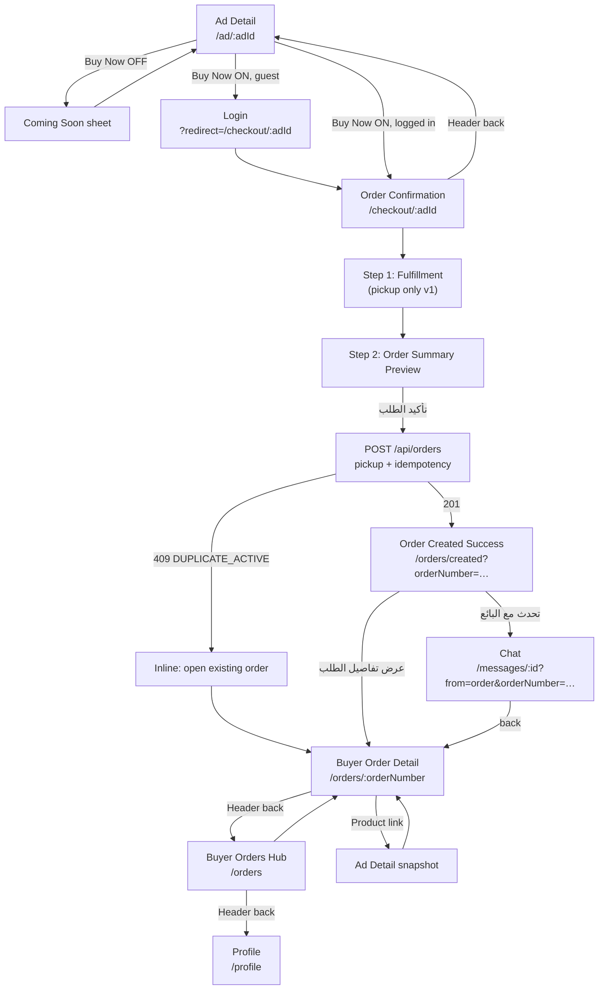

# P17-5 — Buyer Order Flow (UI Specification Lock)

| Field | Value |
|-------|-------|
| **Domain** | P17 — Commerce, Orders & Fulfillment |
| **Sub-phase** | **P17-5-0** — Specification lock (documentation only) |
| **Phase** | **P17-5** — Buyer order flow |
| **Status** | **Active — binding for P17-5 implementation** |
| **Horizon** | 10–50 year marketplace — navigation clarity at scale |
| **Runtime impact (P17-5-0)** | **None** — no routes, UI, API, deploy |

**Parent charter:** [P17-commerce-orders.md](./P17-commerce-orders.md)  
**Navigation contract:** [P17-4-navigation-contract.md](./P17-4-navigation-contract.md) (binding; this doc narrows buyer scope)  
**Orders API:** [P17-4-api.md](./P17-4-api.md)  
**UX reference:** [P17-1-ux-spec.md](./P17-1-ux-spec.md) (Order Summary Preview rules)  
**Domain spec:** [P17-2-order-domain-spec.md](./P17-2-order-domain-spec.md)  

**Execution gate:** No P17-5 code until **P17-5-0 closed** (this document + Mohamed sign-off on scope). No commit/push/deploy without final report approval.

---

## 0. Scope boundary (P17-5 vs later phases)

### In scope (P17-5 implementation)

| Area | Detail |
|------|--------|
| Buyer surfaces | Ad Detail Buy Now entry, Order Confirmation flow, Order Created success, Buyer Orders Hub, Buyer Order Detail |
| API usage | Existing `POST/GET /api/orders*` only — no new endpoints |
| Fulfillment v1 | **`pickup` only** in UI (`fulfillmentMode: "pickup"`) |
| Lifecycle UI | `pending_confirmation`, `confirmed`, `cancelled` (buyer cancel + seller reject presentation) |
| Chat (minimal) | Open thread from order + **return routing** via query params; optional order context banner per §10 |
| Auth | Guest → login with `?redirect=` preserving confirmation intent |
| Flags | STAGING: `P17_BUY_NOW_ENABLED`, `P17_ORDERS_HUB_VISIBLE`, `P17_ORDERS_API_ENABLED` (API server) |

### Explicitly out of scope (deferred)

| Phase | Excluded from P17-5 |
|-------|---------------------|
| **P17-6** | Seller order actions UI (`/seller-orders` mutations) |
| **P17-7** | Shipping method wizard, carrier selection, tracking URLs |
| **P17-8** | `preparing` / `shipped` / `delivered` / `completed` transitions + rich tracking timeline |
| **P17-9** | Order notification types, `/notifications` deep links |
| **P17-10** | Admin orders dashboard |
| **P17-11** | Support tickets, report issue from order |
| **P17-12+** | Trust score, trust & safety overlays |
| **P17-14** | SLA cron, auto-cancel workers |
| **P17-16** | Payment provider UI (P10 owns all payment capture) |
| **P17-19** | PROD commerce activation |
| **Cart** | `/cart`, multi-item checkout |
| **New API** | No routes, schemas, or migrations in P17-5 |

### Terminology lock

| Term | Meaning in P17-5 |
|------|------------------|
| **Checkout** | **Order Confirmation flow** — review + `تأكيد الطلب`; **not** payment |
| **Confirm order** | `POST /api/orders` — creates `pending_confirmation` order |
| **Order number** | Public id `SOUQ-YYYY-NNNNNN` — URL param and display id (`id === orderNumber`) |

---

## 1. Root cause (why buyers get lost today)

| ID | Root cause | User impact | P17-5 disposition |
|----|------------|-------------|-------------------|
| RC-1 | Buy Now opens Coming Soon sheet only (DE-01) | No forward progress after tap | Replace with `/checkout/:adId` when `P17_BUY_NOW_ENABLED=1` |
| RC-2 | No production `/checkout/:adId` route | Flag ON would have no destination | Register route + confirmation wizard |
| RC-3 | Chat (P5) and Orders (P17) are parallel, unlinked | User negotiates in chat but cannot find “official” order | Wire Chat CTA + return contract (§10) |
| RC-4 | Orders hub tabs do not filter list | Tabs imply false states | Filter client-side by status **or** hide non-`all` tabs until wired |
| RC-5 | Hub stat cards hardcoded `0` | Hub feels empty despite orders | Wire `GET /api/orders/stats` **or** hide stat section |
| RC-6 | Order Detail buyer actions are static text (DE-06) | “Contact seller” / “track” are non-actions | Replace with real CTAs (§8) |
| RC-7 | Profile shows Coming Soon on order tiles while hub can work | Contradictory signals | Remove badge when `P17_ORDERS_HUB_VISIBLE=1` |
| RC-8 | API lifecycle stops at `confirmed` (P17-4) | Shipping/complete promises are dead ends | Copy and CTAs must not promise tracking until P17-7/8 |

**Baseline after P17-4A (unchanged):** List → Detail works for canonical `SOUQ-*` when `mock: false`; preview routes (`/orders/test`) removed from prod UX.

---

## 2. Buyer journey (final)

### 2.1 Primary journey (Buy Now path)



### 2.2 Parallel journey (always valid — P5)

| Step | Screen | Rule |
|------|--------|------|
| 1 | Ad Detail | Message Seller / WhatsApp — **unchanged** |
| 2 | Chat `/messages/:conversationId` | No order required |
| 3 | Optional | If buyer later uses Buy Now on same ad → duplicate guard per API |

**Clarity rule on Ad Detail:** Commerce row order remains: **Buy Now** (primary) → Add to Cart (secondary, flag-gated Coming Soon until cart phase) → WhatsApp → Message Seller. One-line helper copy: official order via Buy Now; chat for coordination.

### 2.3 Post-create monitoring journey (P17-5 read-only)

| Status | Buyer primary screen | What buyer can do (P17-5) |
|--------|----------------------|---------------------------|
| `pending_confirmation` | Order Detail | View summary + timeline; **Cancel**; Chat seller |
| `confirmed` | Order Detail | View summary + timeline; Chat seller; **no** ship/track CTAs |
| `cancelled` | Order Detail | Read-only history; back to hub |

Statuses `preparing`, `shipped`, `delivered`, `completed` — **not shown as actionable** in P17-5 (may appear only if API returns them later; UI treats as read-only “قريباً” or maps to nearest known copy — prefer hiding extra actions).

### 2.4 Entry points (buyer)

| Source | Lands on |
|--------|----------|
| Home / Search / Category / Favorites | Ad Detail → Buy Now path |
| Profile → طلباتي | Orders Hub |
| Orders Hub row | Order Detail |
| Order Created success | Order Detail |
| Chat banner «عرض الطلب» (P17-5) | Order Detail |
| Login redirect | Checkout for same `adId` |

**Not in P17-5:** Notification deep links (P17-9).

---

## 3. Required screens

| # | Screen ID | Route | Purpose |
|---|-----------|-------|---------|
| S1 | `ad-detail` | `/ad/:adId` | Discovery + Buy Now entry |
| S2 | `login-gate` | `/login?redirect=…` | Preserve checkout intent |
| S3 | `order-confirmation` | `/checkout/:adId` | Fulfillment + Summary Preview + confirm |
| S4 | `order-created` | `/orders/created?orderNumber=…` | Success + next steps (no back to checkout) |
| S5 | `buyer-orders-hub` | `/orders` | List + navigation to detail |
| S6 | `buyer-order-detail` | `/orders/:orderNumber` | Summary, timeline, CTAs |

**Not required in P17-5:** `/cart`, `/seller-orders/*` (seller), `/admin/orders`, `/account/help` order category, `/dev/*` mocks (remain dev-only or unrouted).

---

## 4. Route map

### 4.1 Production routes (P17-5 implementation)

| Method | Route | Component area | Auth |
|--------|-------|----------------|------|
| GET | `/ad/:adId` | P4 ad detail + commerce actions | Public |
| GET | `/login` | P2 login | Public |
| GET | `/checkout/:adId` | P17 confirmation wizard | **Required** (redirect if guest) |
| GET | `/orders/created` | P17 success | **Required** |
| GET | `/orders` | P17 buyer hub | **Required** |
| GET | `/orders/:orderNumber` | P17 buyer detail | **Required** |
| GET | `/messages/:conversationId` | P5 chat (existing) | **Required** |
| GET | `/profile` | P6 profile + orders entry | **Required** |

### 4.2 URL identifiers

| Entity | URL param | Format |
|--------|-----------|--------|
| Ad | `:adId` | Numeric ad id |
| Order | `:orderNumber` | `SOUQ-YYYY-NNNNNN` only in buyer-facing links |
| Chat return | Query | `from=order`, `orderNumber=SOUQ-…` |

**Forbidden in user-facing buyer links:** `mock-*`, `/orders/test`, numeric-only order ids (unless API legacy fallback internal — UI must emit `orderNumber`).

### 4.3 Query parameters (normative)

| Route | Param | Required | Purpose |
|-------|-------|----------|---------|
| `/login` | `redirect` | When gated | URL-encoded return path (max 120 chars; allowlist below) |
| `/orders/created` | `orderNumber` | Yes | Success screen content |
| `/messages/:id` | `from` | When opened from order | Value: `order` |
| `/messages/:id` | `orderNumber` | When `from=order` | Return + banner context |

**Redirect allowlist (login):**

- `/checkout/:adId` where `:adId` matches `^\d+$`
- `/orders`, `/orders/:orderNumber` (canonical pattern only)
- `/ad/:adId`

Reject all other `redirect` values → `/profile` after login.

---

## 5. Navigation rules

Implements [P17-4-NAV](./P17-4-navigation-contract.md) §1.3 for buyer subset.

| # | Rule | Screen |
|---|------|--------|
| N1 | Exactly **one** primary back target per screen (table below) | All |
| N2 | Order Detail exposes **≥2** exits: back to hub + ad snapshot **or** chat | Detail |
| N6 | Guest Buy Now → login → same checkout `adId` | Ad → Login → Checkout |
| N7 | `P17_BUY_NOW_ENABLED=0` → Coming Soon sheet; **no** navigate to `/checkout` | Ad |
| N8 | `P17_BUY_NOW_ENABLED=1` → Buy Now **must** reach `/checkout/:adId` (logged in) or login redirect — never sheet-only dead end | Ad |
| N10 | Bottom nav unchanged — Orders via Profile only | Global |

### 5.1 Primary back matrix (buyer)

| From | Primary back → |
|------|----------------|
| Checkout step 1 | Ad Detail |
| Checkout step 2 (Summary) | Checkout step 1 |
| Order Created success | Buyer Orders Hub (header ←) |
| Buyer Orders Hub | Profile |
| Buyer Order Detail | Buyer Orders Hub |
| Chat (when `from=order`) | Buyer Order Detail for `orderNumber` |
| Chat (default / from ad) | Ad Detail or Messages list (existing P5 behavior) |

### 5.2 Post-confirm guard

After successful `POST /api/orders`:

- Browser **back** from Order Created or Order Detail **must not** resubmit checkout (wizard state cleared; optional `replace` navigation).
- Repeat confirm with same `Idempotency-Key` returns same order (API contract).

---

## 6. CTA rules

### 6.1 Ad Detail

| CTA | Priority | Flag OFF | Flag ON (logged in) | Flag ON (guest) |
|-----|----------|----------|---------------------|-----------------|
| Buy Now | Primary | Open Coming Soon sheet | `navigate(/checkout/:adId)` | `navigate(/login?redirect=/checkout/:adId)` |
| Add to Cart | Secondary | Coming Soon sheet (same as P17-1B) | **Unchanged** — Coming Soon until cart phase | — |
| Message Seller | Tertiary | Existing P5 flow | Unchanged | Login if needed (existing) |
| WhatsApp | Tertiary | Unchanged | Unchanged | Unchanged |

**Hidden:** Buy Now + Add to Cart when viewer is ad owner (`hidden` prop — current behavior).

### 6.2 Order Confirmation (`/checkout/:adId`)

| Step | Primary CTA | Secondary |
|------|-------------|-----------|
| 1 — Fulfillment | `متابعة` (only pickup selectable) | Header ← → Ad |
| 2 — Summary Preview | `تأكيد الطلب` | `تعديل` → step 1; Header ← → step 1 |

**Copy lock:** No “ادفع الآن”, “Pay now”, or payment brand strings (P17-1, P10 boundary).

### 6.3 Order Created success

| CTA | Priority | Target |
|-----|----------|--------|
| عرض تفاصيل الطلب | Primary | `/orders/:orderNumber` |
| تحدث مع البائع | Secondary | Chat with `?from=order&orderNumber=…` |
| طلباتي | Tertiary (optional text link) | `/orders` |

No primary CTA back to checkout.

### 6.4 Buyer Order Detail

| CTA | Visible when | Action |
|-----|--------------|--------|
| تحدث مع البائع | Always (non-mock) | P5 `startConversation(adId)` + query params |
| إلغاء الطلب | `status === pending_confirmation` | `POST /api/orders/:orderNumber/cancel` |
| عرض الإعلان | Always | `/ad/:adId` (snapshot link) |
| تتبع الشحن | **Hidden** P17-5 | P17-7 |
| الإبلاغ عن مشكلة | **Hidden** P17-5 | P17-11 |
| تأكيد الاستلام | **Hidden** P17-5 | P17-8 |

**Max visible primary actions on detail:** 2 (Chat + Cancel **or** Chat + View ad). Third actions go to secondary row or overflow — never more than 2 filled primary buttons.

### 6.5 Buyer Orders Hub

| CTA | When |
|-----|------|
| Row tap → Detail | `mock: false` and canonical `orderNumber` |
| تصفح (empty) | Zero orders → `/` |
| Tab change | Filters list or no-op if tabs hidden |

---

## 7. Empty states

| Screen | Condition | Content | CTA |
|--------|-----------|---------|-----|
| Orders Hub | `items.length === 0` (not loading) | Title + short explanation | `تصفح` → Home `/` |
| Orders Hub tab | Filtered empty | Tab-specific empty copy (existing i18n keys) | `تصفح` → Home |
| Order Detail | 404 / not found / non-canonical id | Not found card | Back → Hub |
| Order Detail | `mock: true` | Mock banner; **no** cancel/chat mutations | Back → Hub |
| Checkout | Ad not found / not eligible | Error card | Back → Home or Search |
| Checkout | Own ad | Block with `ad_detail.own_ad` copy | Back → Ad |
| Order Created | Missing `orderNumber` query | Redirect → `/orders` | — |

---

## 8. Error states

| Code / case | Where | UX |
|-------------|-------|-----|
| 401 / no session | Any protected route | Redirect login with `redirect` |
| 403 self-purchase | Checkout confirm | Toast + stay on checkout |
| 404 ad | Checkout load | Ad not found empty state |
| 409 `ORDER_DUPLICATE_ACTIVE` | POST create | Inline message + link «عرض الطلب الحالي» → existing order detail |
| 409 `AD_NOT_AVAILABLE` | POST create | Toast + back to Ad |
| 503 API off / mock mutations | POST | Banner: orders unavailable; no retry loop |
| Network / 5xx | POST create | Toast + retry on Summary step only |
| CSRF failure | POST | Toast session expired → login with redirect |
| Cancel not allowed | Detail | Toast — status no longer `pending_confirmation` |
| Invalid `orderNumber` in URL | Detail | Not found |

All error copy via `p17.commerce.*` i18n keys (ar / en / de).

---

## 9. Login redirect rules

| Trigger | Redirect target |
|---------|-----------------|
| Guest taps Buy Now (flag ON) | `/login?redirect=${encodeURIComponent(`/checkout/${adId}`)}` |
| Session expired mid-checkout | Same pattern with current `adId` |
| After successful login | `redirect` if allowlisted → else `/profile` |

**Post-login must not drop `adId`:** redirect path must round-trip to same checkout wizard.

**Session required routes:** `/checkout/:adId`, `/orders/created`, `/orders`, `/orders/:orderNumber`.

---

## 10. Order Created success flow

### 10.1 Sequence

1. User on Summary Preview taps `تأكيد الطلب`.
2. Client sends `POST /api/orders` with body:
   ```json
   {
     "adId": <number>,
     "fulfillmentMode": "pickup",
     "currency": "EUR"
   }
   ```
3. Header `Idempotency-Key`: UUID v4 generated at wizard mount (stable for session).
4. On `201`: read `order.orderNumber`; assert `order.id === order.orderNumber`.
5. Navigate **`replace`** to `/orders/created?orderNumber=SOUQ-…` (prevents checkout back-stack resubmit).
6. Success UI shows:
   - Check icon + `تم إنشاء طلبك`
   - **Order number** monospace prominent
   - Product title + total from response
   - «ماذا بعد» bullets (seller review, track from طلباتي — **no** shipping promises)
7. Primary CTA → Detail; secondary → Chat.

### 10.2 Idempotency UX

Second tap on confirm with same key: API returns same order → navigate to same success/detail without duplicate rows.

---

## 11. Order Detail scope (P17-5)

### 11.1 Data sources

| Block | API |
|-------|-----|
| Summary | `GET /api/orders/:orderNumber` |
| Timeline | `GET /api/orders/:orderNumber/timeline` |
| Cancel | `POST /api/orders/:orderNumber/cancel` |

### 11.2 UI blocks

| Block | Show | Notes |
|-------|------|-------|
| Header + back | Yes | → Hub |
| Mock banner | When `mock: true` | List navigation disabled (P17-4A pattern) |
| Summary card | Yes | title, `orderNumber`, total, `statusLabelAr`, `updatedAtRelativeAr` |
| Timeline | Yes | Map API `items`; empty → timeline empty copy |
| Buyer actions | Yes | Real buttons per §6.4 |
| Seller tools | N/A on buyer variant | — |
| Product image | Optional P17-5 | Use `itemImageUrl` if present in API; else placeholder |
| Issue list | No | P17-11 |

### 11.3 Hub scope (P17-5)

| Block | Rule |
|-------|------|
| List | `GET /api/orders` |
| Stats | Wire `GET /api/orders/stats` **or** hide section |
| Tabs | Filter by status mapping **or** show only `all` tab |
| Mock gate | `interactionDisabled` when `mock: true` |
| Profile entry | Remove Coming Soon badge when hub visible flag ON |

**Tab → status mapping (if tabs enabled):**

| Tab | Include statuses |
|-----|------------------|
| `all` | All |
| `new` | `pending_confirmation` |
| `active` | `confirmed` |
| `completed` | `cancelled` (buyer-visible terminal) + future `completed` |
| `issues` | **Hidden** until P17-11 |

---

## 12. Chat return contract (P17-5 subset of P17-4-NAV §5)

### 12.1 Open from order

| From | Action | Navigation |
|------|--------|------------|
| Order Detail | تحدث مع البائع | `startConversation({ adId })` → on success `/messages/:conversationId?from=order&orderNumber=SOUQ-…` |
| Order Created | تحدث مع البائع | Same |

Uses existing P5 API — **no** new chat endpoints in P17-5.

### 12.2 Return from chat

| Condition | Header back behavior |
|-----------|----------------------|
| `from=order` + valid `orderNumber` | → `/orders/:orderNumber` |
| Otherwise | Existing P5 behavior (messages list / ad) |

### 12.3 Order context banner (P17-5.1 — required in DoD)

When `from=order` and `orderNumber` query present:

```
📦 طلب {orderNumber} · {statusLabelAr}
[ عرض الطلب ← ]  → /orders/:orderNumber
```

| Rule | Detail |
|------|--------|
| Dismiss | **Not allowed** while order non-terminal |
| Data | Status from cached detail fetch or lightweight GET |
| Seller variant | Out of scope — P17-6 |

**Deferred:** `order_number` persisted on conversation row (schema) — P17-5 uses query params only.

**Deferred:** P15 system messages in thread — P17-9 / P17-14.

---

## 13. Order Confirmation flow (checkout) — pickup v1

Implements P17-1 **Order Summary Preview** with shipping step deferred to P17-7.

| Step | UI id | Content |
|------|-------|---------|
| 1/2 | `fulfillment` | Single option selected: **استلام شخصي** (`pickup`); shipping options **not rendered** |
| 2/2 | `summary` | Product snapshot from ad fetch, price, total (= item price), «بعد التأكيد» bullets, `تأكيد الطلب` |

**Ad preload on checkout mount:** Validate ad exists, `approved`, fixed price, viewer ≠ seller.

**Progress indicator:** 2 steps — `استلام` · `مراجعة` (i18n keys under `p17.commerce.checkout.*`).

---

## 14. Feature flags (normative)

| Flag | Surface | OFF | ON |
|------|---------|-----|-----|
| `P17_BUY_NOW_ENABLED` | Ad Detail | Coming Soon sheet | → `/checkout/:adId` |
| `P17_ORDERS_HUB_VISIBLE` | Profile tiles + hub | Hide tiles or badge only | Full hub |
| `P17_ORDERS_API_ENABLED` | API server | Mock GET / 503 POST | Database provider |

**STAGING test:** All three ON for E2E buyer smoke.

**PROD:** Remain OFF until P17-19 (separate approval).

---

## 15. Definition of Done — P17-5 (implementation)

P17-5 is **closed** when all criteria pass on **STAGING** (ref `qkczposlooaldmsjfmun` only):

| # | Criterion |
|---|-----------|
| D1 | Buy Now (logged in, flag ON) → checkout → Summary → `POST /api/orders` → success |
| D2 | Guest Buy Now → login → completes same `adId` checkout |
| D3 | `id === orderNumber` and `SOUQ-YYYY-NNNNNN` visible on created, hub, detail |
| D4 | Order Created uses `replace` navigation; back does not double-create |
| D5 | Hub list row opens Detail with consistent API data (`mock: false`) |
| D6 | Detail: Chat opens and back returns to Detail (`from=order`) |
| D7 | Detail: Cancel works in `pending_confirmation` only |
| D8 | Detail: Ad snapshot link returns to Detail |
| D9 | Flag OFF: Buy Now shows Coming Soon — no `/checkout` navigation |
| D10 | No payment UI, shipping wizard, support, notifications, seller mutations |
| D11 | `pnpm run p17-4:validate` + `p17-4a:staging-smoke` remain PASS |
| D12 | New `p17-5:staging-smoke` (or extended smoke): Ad → create → detail → chat return |
| D13 | `i18n:check` PASS for all new keys |
| D14 | Contract tests: no `mock-buyer-*` in prod paths; no `/orders/test` in profile |
| D15 | Mohamed sign-off + final report before commit/deploy |

### P17-5-0 (this document) — Done when:

| # | Criterion | Status |
|---|-----------|--------|
| 0-1 | `P17-5-ui.md` exists and linked from P17 charter table | ☐ → **Done on merge** |
| 0-2 | Scope, routes, CTAs, DoD approved by Mohamed | ☐ Pending sign-off |
| 0-3 | **No implementation** in P17-5-0 | ✓ |

---

## 16. Implementation package order (post-approval)

| Order | Package | Delivers |
|-------|---------|----------|
| 1 | Routes + flags + login redirect allowlist | §4, §9 |
| 2 | Checkout wizard (pickup + summary) + POST | §13, §10 |
| 3 | Order Created screen | §10 |
| 4 | Ad Buy Now wire | §6.1 |
| 5 | Detail CTAs (chat, cancel, ad link) | §6.4, §11 |
| 6 | Chat banner + return routing | §12 |
| 7 | Hub stats/tabs fix + profile badge | §11.3 |
| 8 | STAGING smoke + final report | §15 |

---

## 17. Risks

| Risk | Mitigation |
|------|------------|
| Scope creep (payment/shipping) | §0 boundary + D10 |
| Duplicate orders | API 409 + idempotency + replace navigation |
| User lost after confirm | §10 success CTAs + N2 |
| Chat without context | §12 banner + return query |
| PROD accidental activation | Flags OFF until P17-19 |
| Tab/stats lies | Wire or hide (§11.3) |

---

*P17-5 UI specification lock — P17-5-0. No runtime changes until implementation approval.*
