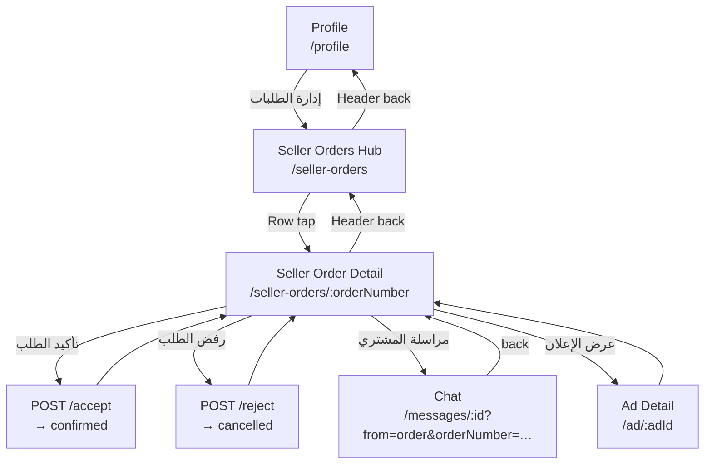

# P17-6 — Seller Order Flow (UI Specification Lock)

| Field | Value |
|-------|-------|
| **Domain** | P17 — Commerce, Orders & Fulfillment |
| **Sub-phase** | **P17-6-0** — Specification lock (documentation only) |
| **Phase** | **P17-6** — Seller order flow UI |
| **Status** | **Active — binding for P17-6 implementation** |
| **Horizon** | 10–50 year marketplace — seller isolation at scale |
| **Runtime impact (P17-6-0)** | **None** — no UI implementation, no API changes, no deploy |

**Parent charter:** [P17-commerce-orders.md](./P17-commerce-orders.md)  
**Navigation contract:** [P17-4-navigation-contract.md](./P17-4-navigation-contract.md) (seller journey §4)  
**Orders API:** [P17-4-api.md](./P17-4-api.md)  
**Buyer reference:** [P17-5-ui.md](./P17-5-ui.md) (parity patterns)  
**Domain spec:** [P17-2-order-domain-spec.md](./P17-2-order-domain-spec.md)  

**STAGING security verification:** `artifacts/api-server/scripts/p17-6-0-seller-security-verify.mjs` — **PASS** (P17-6-0).

**Execution gate:** No P17-6 UI code until **P17-6-0 closed** (this document + Mohamed sign-off). No commit/push/deploy without final report approval.

---

## 0. Scope boundary (P17-6 vs later phases)

### In scope (P17-6 implementation)

| Area | Detail |
|------|--------|
| Seller surfaces | Seller Orders Hub `/seller-orders`, Seller Order Detail `/seller-orders/:orderNumber` |
| API usage | Existing `GET /api/orders/seller`, `GET /api/orders/:orderNumber`, `GET …/timeline`, `POST …/accept`, `POST …/reject` — **no new endpoints** |
| Lifecycle UI | `pending_confirmation` → seller **Accept** / **Reject**; read-only `confirmed`, `cancelled` |
| Chat (minimal) | Open thread from seller detail + **return routing** (`from=order`, `orderNumber`) — same contract as P17-5 §12 |
| Auth | Session required; hub/detail redirect to login if guest |
| Flags | STAGING: `P17_ORDERS_API_ENABLED` (API) + **`VITE_P17_SELLER_ORDERS_ENABLED`** (frontend seller UI) |
| UX polish | Remove P17-5 **deferred** seller placeholder when seller flag ON |

### Explicitly out of scope (deferred)

| Phase | Excluded from P17-6 |
|-------|---------------------|
| **P17-7** | Shipping wizard, carrier, tracking input |
| **P17-8** | `preparing` / `shipped` / `delivered` transitions + rich tracking timeline UI |
| **P17-9** | Order notification types, push deep links |
| **P17-10** | Admin orders dashboard |
| **P17-11** | Support tickets, report issue from order |
| **P17-12+** | Trust overlays |
| **P17-16** | Payment UI |
| **P17-19** | PROD commerce activation |
| **New API** | No routes, schemas, or migrations in P17-6 |
| **Buyer flow** | No changes to P17-5 buyer surfaces except regression safety |

### Terminology lock

| Term | Meaning in P17-6 |
|------|------------------|
| **Confirm order** (seller) | `POST /api/orders/:orderNumber/accept` → `confirmed` |
| **Reject order** (seller) | `POST /api/orders/:orderNumber/reject` → `cancelled` |
| **Order number** | Public id `SOUQ-YYYY-NNNNNN` — URL param; `id === orderNumber` in API |

---

## 1. Root cause (why seller flow is blocked today)

| ID | Root cause | User impact | P17-6 disposition |
|----|------------|-------------|-------------------|
| RC-1 | P17-5 UX polish shows `SellerOrdersPhaseDeferredCard` when buyer flow flags ON | Seller sees “next phase” despite real orders in DB | Remove deferred UI when `VITE_P17_SELLER_ORDERS_ENABLED=1` |
| RC-2 | No `accept` / `reject` in frontend API client or mutations | Seller cannot act on `pending_confirmation` | Wire `orders-api-client` + TanStack mutations |
| RC-3 | Hub tabs (`preparing`, `shipping`) have **no** P17-4 API transitions | Empty/misleading tabs | **3 tabs only** mapped to P17-4 statuses (§7) |
| RC-4 | Seller stat cards hardcoded `0` | Hub feels broken | Derive counts from list client-side **or** hide stats until dedicated endpoint (P17-15) |
| RC-5 | Seller detail shows disabled tool buttons (pre-ship) | False affordances | Replace with **Accept / Reject / Chat** only (§8) |
| RC-6 | No P17-6 spec before P17-6-0 | Implementation drift risk | **This document** |

**API/security baseline (verified P17-6-0):** List isolation by `seller_user_id`; detail/timeline protected by `partyHasAccess`; cross-seller access returns **403**.

---

## 2. Seller journey (final)

### 2.1 Primary journey (intake → decide)



### 2.2 Stage table (P17-6 actions only)

| Status | Seller hub tab | Primary screen | Max 3 primary actions (P17-1 cap) |
|--------|----------------|----------------|-----------------------------------|
| `pending_confirmation` | **جديد** | Order Detail | **تأكيد الطلب** · **رفض الطلب** · **مراسلة المشتري** |
| `confirmed` | **نشط** | Order Detail | **مراسلة المشتري** only (+ secondary عرض الإعلان) |
| `cancelled` | **منتهي** | Order Detail | Read-only · **مراسلة المشتري** (optional) · عرض الإعلان |

Statuses `preparing`, `shipped`, `delivered`, `completed` — if returned by API later: **read-only** in hub/detail; **no** action CTAs until P17-7/8.

### 2.3 Entry points (seller)

| Source | Lands on |
|--------|----------|
| Profile → إدارة الطلبات | `/seller-orders` |
| Seller Orders Hub row | `/seller-orders/:orderNumber` |
| Chat banner «عرض الطلب» (seller role) | `/seller-orders/:orderNumber` |
| Login redirect (future) | `/seller-orders` |

**Not in P17-6:** Notification deep links (P17-9).

---

## 3. Required screens

| # | Screen ID | Route | Purpose |
|---|-----------|-------|---------|
| S1 | `seller-orders-hub` | `/seller-orders` | List seller orders + tabs |
| S2 | `seller-order-detail` | `/seller-orders/:orderNumber` | Summary, timeline, seller CTAs |

**Reuses:** `OrderDetailPage` variant `seller`, `OrdersPage` variant `seller` — same shell as P17-4A; **behavior** changes per this spec.

**Not required in P17-6:** `/admin/orders`, shipping wizard, `/dev/seller-orders-mock` in prod paths.

---

## 4. Route map

### 4.1 Production routes (P17-6)

| Method | Route | Component | Auth |
|--------|-------|-----------|------|
| GET | `/seller-orders` | `OrdersPage` variant seller | **Required** |
| GET | `/seller-orders/:orderNumber` | `OrderDetailPage` variant seller | **Required** |
| GET | `/messages/:conversationId` | P5 chat (existing) | **Required** |
| GET | `/ad/:adId` | P4 ad detail (view listing) | Public |
| GET | `/profile` | Profile + seller entry tile | **Required** |

### 4.2 URL identifiers

| Entity | Param | Format |
|--------|-------|--------|
| Order | `:orderNumber` | `SOUQ-YYYY-NNNNNN` only in seller-facing links |

**Forbidden in seller links:** `mock-*`, numeric internal id-only URLs in UI navigation.

### 4.3 Query parameters (chat return)

| Route | Param | Purpose |
|-------|-------|---------|
| `/messages/:id` | `from=order` | Return to seller detail |
| `/messages/:id` | `orderNumber` | Banner + back target `/seller-orders/:orderNumber` |

---

## 5. Navigation rules

| ID | Rule |
|----|------|
| N1 | Header back on Seller Hub → `/profile` |
| N2 | Header back on Seller Detail → `/seller-orders` |
| N3 | Chat opened from order → back → **Seller Detail** (not messages list) when `from=order` |
| N4 | After accept/reject success → stay on Detail (refresh query) or toast + invalidate list |
| N5 | Guest on `/seller-orders*` → redirect `/login?redirect=/seller-orders` (or encoded detail path) |
| N6 | `mock: true` on list → show `CommerceMockDataBanner`; cards non-navigable (same as buyer hub) |
| N7 | Flag `VITE_P17_SELLER_ORDERS_ENABLED=0` → show honest deferred card (P17-5 polish text) — **no** fake tabs |
| N8 | Cross-seller order URL → API 403 → show not-found/forbidden UI (no leak of existence) |

---

## 6. Tabs definition (Seller Hub)

**P17-6 uses 4 tabs** (`all` + 3 filtered) — not 5. Aligns with P17-4 API scope (no prepare/ship mutations).

| Tab value | Label (ar) | Status filter |
|-----------|------------|---------------|
| `all` | الكل | All orders for seller |
| `new` | جديد | `pending_confirmation` |
| `active` | نشط | `confirmed` |
| `done` | منتهي | `cancelled` (+ `completed` when present) |

**Removed from P17-6 UI:** `preparing`, `shipping` tabs (DE-04 — hide until P17-7).

**Empty tab:** Use `seller_empty_tab_*` copy — no “قريبًا” card.

---

## 7. CTA rules

### 7.1 Global

| Rule | Detail |
|------|--------|
| Max primary | **3** visible primary actions per detail state (P17-4-NAV §4.3) |
| Visual | `#0A0A0A` background, `#c2eb6c` primary, `rounded-2xl`, lime glow on primary CTA |
| Forbidden | Shipping, tracking, support, payment, admin CTAs |

### 7.2 Seller Order Detail — by status

| Status | Primary CTAs | Secondary |
|--------|--------------|-----------|
| `pending_confirmation` | تأكيد الطلب (lime) · رفض الطلب (ghost/destructive outline) · مراسلة المشتري | عرض الإعلان |
| `confirmed` | مراسلة المشتري | عرض الإعلان |
| `cancelled` | — (read-only headline) | عرض الإعلان; optional chat |

**Reject:** Confirm dialog required (destructive action).

**Accept:** Optional confirm dialog (single tap allowed if UX tested).

### 7.3 Disabled / hidden

| CTA | P17-6 |
|-----|-------|
| بدء التجهيز | Hidden |
| تم الشحن | Hidden |
| إضافة تتبع | Hidden |
| إغلاق الطلب | Hidden |
| الإبلاغ عن مشكلة | Hidden |

---

## 8. Accept flow

| Step | Actor | Action | API | Result UI |
|------|-------|--------|-----|-----------|
| 1 | Seller | Opens detail `pending_confirmation` | `GET /api/orders/:orderNumber` | Status «طلب جديد — يحتاج تأكيدك» |
| 2 | Seller | Taps **تأكيد الطلب** | `POST /api/orders/:orderNumber/accept` + CSRF | Loading on button |
| 3 | System | 200 + `order.status=confirmed` | — | Toast success; invalidate list + detail + timeline |
| 4 | Seller | — | — | CTAs: chat + view ad only; tab **نشط** |

**Errors:**

| HTTP | Code | UI |
|------|------|-----|
| 403 | FORBIDDEN | Toast — not your order |
| 409 | INVALID_STATE | Toast — state changed |
| 503 | ORDER_API_DISABLED | Banner — API off |

---

## 9. Reject flow

| Step | Actor | Action | API | Result UI |
|------|-------|--------|-----|-----------|
| 1 | Seller | Taps **رفض الطلب** | — | Confirm dialog |
| 2 | Seller | Confirms | `POST /api/orders/:orderNumber/reject` + CSRF | Loading |
| 3 | System | 200 + `order.status=cancelled` | — | Toast; invalidate queries |
| 4 | Seller | — | — | Read-only; tab **منتهي** |

Same error matrix as §8.

---

## 10. Chat integration (P17-6 subset of P17-4-NAV §5)

### 10.1 Open from seller order

| From | Label | Navigation |
|------|-------|------------|
| Seller Order Detail | مراسلة المشتري | `startConversation({ adId })` → `/messages/:conversationId?from=order&orderNumber=SOUQ-…` |

Uses existing P5 API — **no** new chat endpoints.

### 10.2 Return from chat

| Condition | Header back |
|-----------|-------------|
| `from=order` + valid `orderNumber` | → `/seller-orders/:orderNumber` |
| Otherwise | Existing P5 default |

### 10.3 Order context banner (seller path)

When seller opens chat from order, banner «عرض الطلب» targets **`/seller-orders/:orderNumber`** (not buyer `/orders/…`).

**P17-6-1:** Extend chat banner routing to respect seller vs buyer session on same `orderNumber` (use entry path or role hint).

---

## 11. Order detail scope (seller)

| Section | P17-6 |
|---------|-------|
| Summary card | Order number, product title, price, status (seller label), last updated |
| Timeline | `GET …/timeline` — append-only history |
| Seller actions | §7 — status-gated |
| Buyer PII | **No** full address book UI in P17-6 (pickup v1; shipping address deferred P17-7) |
| Issues list | **Hidden** until P17-11 |

---

## 12. Empty states

| Surface | Condition | Copy direction |
|---------|-----------|----------------|
| Hub `all` | Zero orders | «لا توجد طلبات للبائع» + guidance (manage ads) |
| Hub tab | Zero in tab | Tab-specific empty (`seller_empty_tab_*`) |
| Detail | 404 / 403 | «الطلب غير موجود» — back to hub |
| API mock | `mock: true` | `CommerceMockDataBanner` — no navigation |
| Flag OFF | Seller flag 0 | Phase deferred card (honest — no fake queue) |

**Forbidden:** Large «قريبًا» feature list promising shipping/tracking.

---

## 13. Error states

| Scenario | UX |
|----------|-----|
| Network failure on list | Retry + back to profile |
| Accept/reject failure | Toast + preserve detail state |
| 409 version conflict | Toast «تم تحديث الطلب» + refetch |
| Not seller of order | 403 → generic not found |
| Unauthenticated | Redirect login with `redirect` |

---

## 14. API contract (read-only reference — no changes in P17-6)

| Method | Path | Seller use |
|--------|------|------------|
| GET | `/api/orders/seller` | Hub list — filtered `seller_user_id = session` |
| GET | `/api/orders/:orderNumber` | Detail — `partyHasAccess` |
| GET | `/api/orders/:orderNumber/timeline` | Timeline — `requireOrderAccess` |
| POST | `/api/orders/:orderNumber/accept` | Confirm |
| POST | `/api/orders/:orderNumber/reject` | Reject |

**Authorization (verified STAGING):**

```text
listSellerOrders(userId)     → WHERE seller_user_id = userId
getOrderDetailForUser        → partyHasAccess(buyer OR seller)
getTimeline                  → requireOrderAccess → partyHasAccess
acceptOrder / rejectOrder    → sellerHasAccess ONLY
```

---

## 15. Feature flags (normative)

| Flag | Layer | OFF | ON |
|------|-------|-----|-----|
| `P17_ORDERS_API_ENABLED` | API server | Mock GET / 503 POST | Database provider |
| `VITE_P17_ORDERS_HUB_VISIBLE` | Frontend | Hide profile tiles / badge | Show orders entry tiles |
| **`VITE_P17_SELLER_ORDERS_ENABLED`** | Frontend | Seller deferred placeholder | Full seller hub + detail + mutations |

**Rule:** `VITE_P17_SELLER_ORDERS_ENABLED` is **independent** of `isP17BuyerFlowActive()` — buyer ON must not block seller OFF/ON.

**STAGING E2E:** `P17_ORDERS_API_ENABLED=1` + `VITE_P17_ORDERS_HUB_VISIBLE=1` + `VITE_P17_SELLER_ORDERS_ENABLED=1`.

**PROD:** All OFF until P17-19.

---

## 16. Definition of Done — P17-6 (implementation)

P17-6 is **closed** when all pass on **STAGING** (`qkczposlooaldmsjfmun` only):

| # | Criterion |
|---|-----------|
| D1 | Seller hub lists only own orders (`GET /api/orders/seller`, `mock: false`) |
| D2 | Tabs `all/new/active/done` filter correctly |
| D3 | Detail `pending_confirmation`: Accept → `confirmed` |
| D4 | Detail `pending_confirmation`: Reject → `cancelled` |
| D5 | Seller A cannot open Seller B order (403 UI) |
| D6 | Timeline loads on own orders; blocked cross-seller |
| D7 | Chat from detail → back returns to seller detail |
| D8 | View ad → `/ad/:adId` → back |
| D9 | No shipping/tracking/support/payment CTAs |
| D10 | Flag OFF: deferred card — no misleading tabs |
| D11 | `p17-6-0-seller-security-verify.mjs` PASS |
| D12 | `p17-4a:staging-smoke` + P17-5 regression PASS |
| D13 | `i18n:check` PASS |
| D14 | Desktop + mobile LAN smoke |
| D15 | Mohamed sign-off before commit/deploy |

### P17-6-0 (this document) — Done when:

| # | Criterion | Status |
|---|-----------|--------|
| 0-1 | `P17-6-ui.md` exists | ✓ |
| 0-2 | STAGING seller security verify PASS | ✓ |
| 0-3 | Scope approved by Mohamed | ☐ Pending sign-off |
| 0-4 | **No P17-6 UI implementation** in P17-6-0 | ✓ |

---

## 17. Implementation package order (post-approval)

| Order | Package | Delivers |
|-------|---------|----------|
| 1 | `VITE_P17_SELLER_ORDERS_ENABLED` + remove deferred gate | §1 RC-1, §15 |
| 2 | API client + mutations (accept/reject) | §8–9 |
| 3 | Seller hub: tabs + list + empty states | §6–7, §12 |
| 4 | Seller detail: `SellerActionsCard` | §7–8 |
| 5 | Chat return + banner seller URL | §10 |
| 6 | i18n keys + stat cards optional | §1 RC-4 |
| 7 | STAGING smoke + final report | §16 |

---

## 18. Risks

| Risk | Mitigation |
|------|------------|
| Cross-seller data leak | API verified §14; D5 |
| Scope creep (shipping) | §0 + D9 |
| Tab lies | 3-tab model §6 |
| Buyer regression | D12 |
| PROD accidental ON | Flags §15 |

---

*P17-6 UI specification lock — P17-6-0. No runtime UI changes until implementation approval.*
