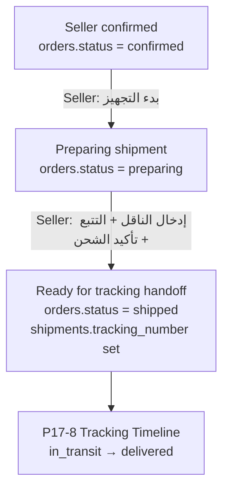
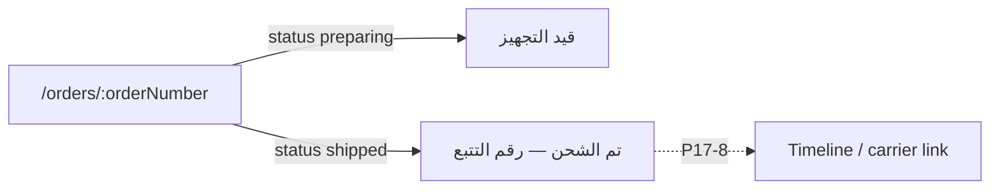

# P17-7 — Shipping Workflow (Specification Lock)

| Field | Value |
|-------|-------|
| **Domain** | P17 — Commerce, Orders & Fulfillment |
| **Sub-phase** | **P17-7-0** — Specification lock (documentation only) |
| **Phase** | **P17-7** — Shipping workflow (seller prepare → ready for tracking) |
| **Status** | **Active — binding for P17-7 implementation** |
| **Horizon** | 10–50 year marketplace — immutable snapshots, append-only history |
| **Runtime impact (P17-7-0)** | **None** — no UI, API, DB migration, or deploy |

**Parent charter:** [P17-commerce-orders.md](./P17-commerce-orders.md)  
**Domain spec:** [P17-2-order-domain-spec.md](./P17-2-order-domain-spec.md)  
**Navigation contract:** [P17-4-navigation-contract.md](./P17-4-navigation-contract.md)  
**Buyer reference:** [P17-5-ui.md](./P17-5-ui.md)  
**Seller reference:** [P17-6-ui.md](./P17-6-ui.md)  
**Address + chat contract (binding sub-spec):** [P17-7A-order-address-seller-chat-spec.md](./P17-7A-order-address-seller-chat-spec.md)  
**Next phase (out of scope here):** **P17-8** — Tracking timeline (`in_transit`, `out_for_delivery`, `delivered`, `shipment_events` UI)

**STAGING verification:** `artifacts/api-server/scripts/p17-7-0-staging-shipping-readiness.mjs`

**Execution gate:** No P17-7 code until **P17-7-0 closed** (this document + Mohamed sign-off). No commit/push/deploy without explicit approval.

---

## 0. Scope boundary (P17-7 vs later phases)

### In scope (P17-7 implementation — future)

| Area | Detail |
|------|--------|
| **Entry state** | `orders.status = confirmed` (seller accepted — P17-6 exit) |
| **Exit state (shipping)** | `orders.status = shipped` + `shipments` row with `tracking_number` + `carrier_*` = **ready for P17-8 tracking UI** |
| **Exit state (pickup)** | `orders.status = delivered` from `preparing` (no `shipments` required) — pickup handoff only |
| **Seller UX** | Start preparing · enter carrier/tracking · mark ready to ship |
| **Buyer UX** | Read-only shipping status on order detail (no rich tracking timeline) |
| **Address** | Persist/checkout snapshot into `buyer_addresses` for `fulfillment_mode = shipping` |
| **API** | New idempotent transitions + shipment upsert (no carrier webhooks) |
| **Flags** | `VITE_P17_SHIPPING_ENABLED` (frontend) + existing `P17_ORDERS_API_ENABLED` (API) — exact names locked in P17-7-1 |

### Explicitly out of scope (deferred)

| Phase | Excluded from P17-7 |
|-------|---------------------|
| **P17-8** | `in_transit`, `out_for_delivery`, `delivered` transitions; `shipment_events` timeline UI; carrier webhooks |
| **P17-9** | Order push notifications (`order.shipped`, deep links) |
| **P17-10** | Admin orders dashboard |
| **P17-11** | Support / report issue from order |
| **P17-12+** | Trust score overlays |
| **P17-16** | Payment provider UI |
| **P17-17** | Carrier API integration |
| **P17-19** | PROD commerce activation |

### Terminology lock (UX vs DB)

| UX term (P17-7) | Canonical `orders.status` | Notes |
|-----------------|---------------------------|--------|
| Seller confirmed | `confirmed` | P17-6 exit — no P17-7 mutation |
| Preparing shipment | `preparing` | Seller started packing / shipping prep |
| Ready for shipment / Ready for tracking | `shipped` | Tracking + carrier captured; **P17-8** owns transit events |
| Ready for pickup | `delivered` (pickup only) | Skips `shipped` — see §2.3 |

**Forbidden in P17-7:** New DB status strings (`preparing_shipment`, `ready_for_shipment`) — use existing P17-3 / P17-2 enum only.

---

## 1. Root cause (why shipping is blocked today)

| ID | Root cause | User impact | P17-7 disposition |
|----|------------|-------------|-------------------|
| RC-1 | P17-4 API implements only `create`, `accept`, `reject`, `cancel` — no `preparing` / `shipped` transitions | Seller cannot progress after confirm | Add transitions in P17-7 API (not in P17-7-0) |
| RC-2 | P17-5 checkout uses **pickup only** — no address step | Shipping orders lack `buyer_addresses` | P17-7 checkout extension or post-confirm address capture (spec §5) |
| RC-3 | P17-6 seller UI explicitly excludes shipping CTAs | Seller sees confirmed with no next step | P17-7 seller detail + hub tabs for preparing/shipping |
| RC-4 | `shipments` / `shipment_events` tables exist but **no repository writes** | Schema ready, behavior missing | P17-7 service layer upsert `shipments` on mark-shipped |
| RC-5 | P17-8 timeline states exist in DB check constraint but **no UI/API** | Confusion if exposed early | P17-7 UI shows collapsed “تم الشحن — التتبع قريبًا” until P17-8 flag |
| RC-6 | No P17-7 spec before implementation | Scope creep into tracking/notifications | **This document** |

**STAGING baseline (P17-7-0 verify):** Tables `buyer_addresses`, `shipments`, `shipment_events` present with FKs and indexes; `orders.status` allows `confirmed` → `preparing` → `shipped`.

---

## 2. Shipping journey

### 2.1 Shipping mode (primary P17-7 path)



| Step | Actor | Screen | System action | `orders.status` | `shipments` |
|------|-------|--------|---------------|-----------------|-------------|
| 0 | — | Seller detail (P17-6 exit) | — | `confirmed` | row may not exist |
| 1 | Seller | Seller order detail / shipping panel | `POST …/start-preparing` (name TBD) | `preparing` | optional create empty row |
| 2 | Seller | Shipping form (carrier, tracking) | validate + upsert `shipments` | `preparing` | `carrier_*`, `tracking_number` draft OK |
| 3 | Seller | Confirm ship CTA | `POST …/mark-shipped` (name TBD); set `shipped_at` | `shipped` | **required** tracking + carrier |
| 4 | Buyer | Buyer order detail | read-only status | `shipped` | read via order detail API |
| 5 | — | — | **Stop P17-7** — P17-8 adds transit | `shipped` → … | `shipment_events` append |

### 2.2 Buyer journey (shipping — read-only in P17-7)



- Buyer **cannot** edit address after confirm (v1) — contact seller via chat.
- Buyer sees **masked** address summary (city + country) on detail when `buyer_addresses` exists — never full PII in list cards.

### 2.3 Pickup branch (minimal P17-7)

| Step | `orders.status` | Seller CTA | `shipments` |
|------|-----------------|------------|-------------|
| After confirm | `confirmed` | بدء التجهيز | — |
| Ready for handoff | `delivered` | جاهز للاستلام | **no** shipment row |

Pickup **does not** use `shipped` or tracking. P17-7 pickup is one transition: `preparing` → `delivered` with event `seller_marked_pickup_ready` (P17-2).

### 2.4 What “Ready For Tracking” means (P17-7 exit criterion)

| Criterion | Rule |
|-----------|------|
| Order status | `shipped` |
| Shipment row | Exists, 1:1 `order_id` |
| `tracking_number` | Non-empty, validated format (seller-entered v1) |
| `carrier_label` | Non-empty (or `carrier_code` from enum) |
| `shipped_at` | Set to transition timestamp |
| **Not required in P17-7** | Any `shipment_events` rows — **P17-8** |

---

## 3. Shipping states

### 3.1 Order statuses used in P17-7

| Status | Arabic (buyer) | Arabic (seller) | P17-7 mutable? |
|--------|----------------|-----------------|----------------|
| `confirmed` | تم تأكيد الطلب | جهّز الشحنة | Entry only (from P17-6) |
| `preparing` | قيد التجهيز | قيد التجهيز | Yes — seller start prep |
| `shipped` | تم الشحن | تم الشحن | Yes — terminal **for P17-7** (handoff to P17-8) |

### 3.2 Statuses forbidden in P17-7 UI/actions

| Status | Owner |
|--------|-------|
| `in_transit` | P17-8 |
| `out_for_delivery` | P17-8 |
| `delivered` (shipping path) | P17-8 |
| `buyer_confirmed`, `completed` | Post-delivery |
| `draft`, `pending_confirmation`, `cancelled` | P17-5 / P17-6 |

### 3.3 State diagram (shipping mode only)

```
confirmed
  └─ seller start preparing ──▶ preparing
preparing
  └─ seller mark shipped (+ shipment snapshot) ──▶ shipped   ← P17-7 END
shipped
  └─ (P17-8 only) ──▶ in_transit ──▶ out_for_delivery ──▶ delivered ──▶ …
```

### 3.4 History events (append-only `order_status_history`)

| Transition | `event_code` (P17-2) | `public_message_ar` |
|------------|----------------------|---------------------|
| → `preparing` | `seller_started_preparing` | البائع يجهّز طلبك |
| → `shipped` | `seller_marked_shipped` | تم شحن طلبك |

---

## 4. Required screens

### 4.1 Seller (P17-7)

| ID | Screen | Route | When visible |
|----|--------|-------|--------------|
| S1 | Seller Orders Hub (extended) | `/seller-orders` | Tabs **تجهيز** / **شحن** map to `preparing` / `shipped` (replaces P17-6 deferral) |
| S2 | Seller Order Detail (extended) | `/seller-orders/:orderNumber` | `confirmed` / `preparing` / `shipped` read paths |
| S3 | Shipping actions panel | Embedded in S2 | `confirmed` → start prep; `preparing` → ship form |
| S4 | Mark shipped form | Modal or inline in S2 | `preparing` + `fulfillment_mode = shipping` |
| S5 | Pickup ready CTA | Inline in S2 | `preparing` + `fulfillment_mode = pickup` |

**Not in P17-7:** Standalone `/seller-shipping` wizard route (optional P17-7-1 polish — default embed in detail per P17-6 pattern).

### 4.2 Buyer (P17-7)

| ID | Screen | Route | When visible |
|----|--------|-------|--------------|
| B1 | Buyer Order Detail (extended) | `/orders/:orderNumber` | Show shipping block when `preparing` or `shipped` |
| B2 | Shipping status card | Embedded in B1 | Carrier label + tracking (copy) when `shipped` |
| B3 | Checkout address step | `/checkout/:adId` | **If** shipping mode enabled in P17-7 — step 1 address (P17-1 §checkout) |

**Not in P17-7:** Full tracking timeline page, map, carrier deep links (P17-8).

### 4.3 Visual identity (all screens)

- Background `#0A0A0A`, primary `#c2eb6c`, RTL, `rounded-2xl`, card-based — same as P17-5/P17-6.
- Forbidden: `bg-card`, `zinc-900`, `zinc-950`, `#0A0D12`, `#10131A`.

---

## 5. Navigation rules

| ID | Rule |
|----|------|
| N1 | Seller hub → row → `/seller-orders/:orderNumber` (unchanged P17-6) |
| N2 | Seller detail header back → `/seller-orders` |
| N3 | Seller detail → chat → back → seller detail (`orderRole=seller` — P17-6) |
| N4 | Buyer detail header back → `/orders` |
| N5 | Buyer detail → chat → back → buyer detail (`orderRole=buyer`) |
| N6 | After mark shipped success → **stay on seller detail** (refresh queries) |
| N7 | Buyer must not navigate to seller routes; 403 → not-found UI |
| N8 | `shipped` buyer sees tracking text; link to external carrier optional (opens new tab) — no in-app timeline until P17-8 |
| N9 | Guest on order routes → login redirect with `redirect` param (P17-5) |
| N10 | Flag OFF → hide shipping CTAs; honest copy “الشحن — المرحلة التالية” only if flag OFF |

**No new top-level nav item** — shipping lives inside order detail (per P17-4-NAV).

---

## 6. Address rules (`buyer_addresses`)

### 6.1 Purpose

`buyer_addresses` is an **immutable per-order snapshot** (1:1 `order_id`). Profile saved addresses remain **P6**; P17 copies at order confirm.

### 6.2 When required

| `fulfillment_mode` | `buyer_addresses` row |
|--------------------|------------------------|
| `shipping` | **Required** before `pending_confirmation` → `confirmed` path completes (or before `mark-shipped` latest) |
| `pickup` | **Optional** — nullable in v1 (P17-5 pickup-only) |

### 6.3 Fields (v1)

| Field | Required | Notes |
|-------|----------|--------|
| `city` | Yes | |
| `country_code` | Yes | ISO-3166 alpha-2 |
| `line1` | Yes | Street |
| `line2` | No | |
| `postal_code` | No | Country-dependent |
| `recipient_name` | Recommended | |
| `phone` | Recommended | E.164 validation |
| `label` | No | e.g. المنزل |
| `source_address_id` | No | P6 saved address id if copied |

### 6.4 Visibility

| Actor | Sees |
|-------|------|
| Buyer | Full snapshot on own order detail |
| Seller | Summary only: city, country, postal (if any), recipient — **no** phone in list; phone on detail policy TBD P17-7-1 |
| Admin | P17-10 |
| Public / other users | **Never** |

### 6.5 Mutations

- **No UPDATE** on snapshot after create (corrections = admin note or cancel/recreate order — out of P17-7).
- **DELETE** cascades with `orders` (FK `ON DELETE CASCADE`).

### 6.6 P17-5 gap (current)

Today v1 checkout creates **pickup** orders without `buyer_addresses`. P17-7 implementation must either:

1. Enable checkout step 1 (address) for `fulfillment_mode = shipping`, **or**
2. Block `mark-shipped` until address backfill endpoint runs (seller-visible “بانتظار عنوان المشتري”).

**P17-7-0 decision:** Spec requires (1) for production shipping; (2) acceptable STAGING interim only.

---

## 7. Shipments table rules (`shipments`)

| Rule | Detail |
|------|--------|
| Cardinality | 1:1 `order_id` (unique index) |
| Created | On first seller shipping action or lazily on `mark-shipped` |
| `tracking_number` | Required before `orders.status = shipped` |
| `carrier_label` | Required display name v1 |
| `carrier_code` | Optional enum (`dhl`, `hermes`, …) — P17-7-1 catalog |
| `shipped_at` | Set on transition to `shipped` |
| `estimated_delivery_at` | Optional manual seller input |
| `delivered_at` | **P17-8** — not set in P17-7 |

---

## 8. API contract (future P17-7 — reference only)

**P17-7-0 adds no routes.** Planned mutations (names locked at P17-7-1):

| Method | Path (illustrative) | Actor | From → To |
|--------|---------------------|-------|-----------|
| POST | `/api/orders/:orderNumber/start-preparing` | seller | `confirmed` → `preparing` |
| POST | `/api/orders/:orderNumber/mark-shipped` | seller | `preparing` → `shipped` (+ shipment body) |
| POST | `/api/orders/:orderNumber/mark-pickup-ready` | seller | `preparing` → `delivered` (pickup) |
| PATCH | `/api/orders/:orderNumber/shipment` | seller | Update draft tracking while `preparing` only |

All: CSRF, `partyHasAccess`, optimistic `version`, idempotent responses.

**Read extensions:**

- Order detail includes `buyerAddressSummary`, `shipment` (nullable), `fulfillmentMode`.

---

## 9. Feature flags (planned)

| Flag | Layer | Purpose |
|------|-------|---------|
| `P17_ORDERS_API_ENABLED` | API | Existing — must be `1` on STAGING |
| `VITE_P17_SELLER_ORDERS_ENABLED` | Frontend | P17-6 prerequisite |
| `VITE_P17_SHIPPING_ENABLED` | Frontend | Gates P17-7 UI (exact name in P17-7-1) |

---

## 10. Definition of Done (P17-7 implementation — not P17-7-0)

| ID | Criterion | Verifiable by |
|----|-----------|---------------|
| D1 | P17-7-0 doc approved | Mohamed sign-off |
| D2 | STAGING schema verify PASS | `p17-7-0-staging-shipping-readiness.mjs` |
| D3 | Seller `confirmed` → `preparing` → `shipped` on shipping order | API test + UI |
| D4 | `shipments` row populated with tracking on `shipped` | DB spot-check |
| D5 | `buyer_addresses` exists for shipping orders at confirm | DB + checkout |
| D6 | Buyer detail shows preparing/shipped copy (no P17-8 timeline) | Playwright |
| D7 | Pickup branch `preparing` → `delivered` without shipment | API test |
| D8 | No `in_transit` / notification / admin / payment CTAs | Code review |
| D9 | P17-5 / P17-6 regression PASS | `p17-5:validate`, seller smoke |
| D10 | Cross-seller / cross-buyer access 403 | Security script extension |
| D11 | i18n `p17.commerce.shipping.*` keys ar/en/de | `i18n:check` |
| D12 | Flag OFF → no shipping CTAs in prod paths | Env test |

**P17-7-0 Done when:** This document exists + STAGING readiness PASS + no runtime changes.

---

## 11. Risks

| Risk | Mitigation |
|------|------------|
| Scope creep into P17-8 tracking | §0 boundary + D8 |
| Address PII leak to seller | §6.4 summary-only |
| Shipping orders without address | §6.6 block mark-shipped |
| Duplicate shipment rows | DB unique on `order_id` |
| P17-6 regression | Separate feature flag |

---

## 12. Rollback (P17-7-0)

- Revert `docs/architecture/P17-7-shipping-workflow.md` and doc index links only.
- **No production impact.**

---

*P17-7-0 — Shipping Workflow Specification Lock. Documentation only.*
