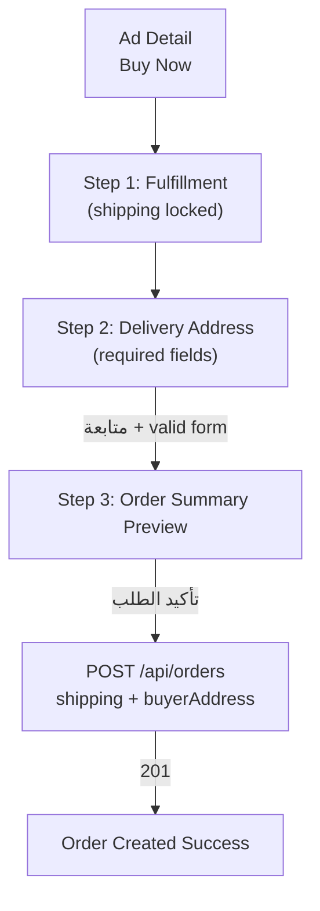

# P17-7A — Order Address + Seller Confirmation + Chat Contract (Specification Lock)

| Field | Value |
|-------|-------|
| **Domain** | P17 — Commerce, Orders & Fulfillment |
| **Sub-phase** | **P17-7A-0** — Specification lock (documentation only) |
| **Phase** | **P17-7A** — Address gate · seller confirm UX · chat draft · buyer status sync |
| **Status** | **Active — binding for P17-7A implementation** |
| **Horizon** | 10–50 year marketplace — immutable address snapshots, idempotent create, P5 chat contract |
| **Runtime impact (P17-7A-0)** | **None** — no UI, API, DB migration, deploy, commit |

**Parent charter:** [P17-commerce-orders.md](./P17-commerce-orders.md)  
**Shipping workflow (P17-7):** [P17-7-shipping-workflow.md](./P17-7-shipping-workflow.md)  
**Buyer flow:** [P17-5-ui.md](./P17-5-ui.md)  
**Seller flow:** [P17-6-ui.md](./P17-6-ui.md)  
**Navigation + chat banner:** [P17-4-navigation-contract.md](./P17-4-navigation-contract.md) §5  
**Orders API:** [P17-4-api.md](./P17-4-api.md)  
**Domain spec:** [P17-2-order-domain-spec.md](./P17-2-order-domain-spec.md)

**Execution gate:** No P17-7A code until **P17-7A-0 closed** (this document + Mohamed sign-off). No commit/push/deploy without explicit approval.

---

## 0. Scope boundary (P17-7A vs later phases)

### In scope (P17-7A implementation — future)

| Area | Detail |
|------|--------|
| **Buyer address gate** | Shipping orders **cannot** be created without a complete delivery address saved to `buyer_addresses` |
| **Checkout extension** | Address step before Order Summary Preview when ad requires shipping |
| **Fulfillment mode lock** | Derive `pickup` vs `shipping` from ad `details.shipping.pickupOnly` (P4 stored details) |
| **Chat draft contract** | Open chat from order with editable prefilled message — **no auto-send** |
| **Buyer status clarity** | Buyer sees updated labels after seller accept/reject and shipping transitions |
| **Buyer refetch contract** | Detail/hub refresh or requery after seller mutations (no push — P17-9 deferred) |
| **Anti-duplicate rules** | Formalize and verify existing API guards + UI disable states |
| **Seller confirmation UX** | Seller accept/reject unchanged in API; buyer-facing copy + timeline sync locked here |
| **Flags** | Existing `P17_ORDERS_API_ENABLED`, `VITE_P17_SHIPPING_ENABLED`, `P17_BUY_NOW_ENABLED` — no new env until P17-7A-1 |

### Explicitly out of scope (deferred)

| Phase | Excluded from P17-7A |
|-------|----------------------|
| **P17-8** | Tracking timeline (`in_transit`, `out_for_delivery`, rich `shipment_events` UI) |
| **P17-9** | Push notifications, system chat lines via P15 fan-out |
| **P17-10** | Admin orders dashboard |
| **P17-11** | Support tickets from order |
| **P17-16 / P10** | Payments |
| **P17-17** | Carrier API integrations (DHL/DPD/UPS) |
| **P17-12+** | Reviews, trust score |
| **P6** | Saved address book UI / profile address CRUD |
| **P5 schema** | Persist `order_number` on `conversations` row — query params only (P17-5 §12) |
| **New DB tables** | Use existing `buyer_addresses` — no migration in P17-7A unless field constraint change approved separately |

---

## 1. Root cause

| ID | Root cause | User impact | P17-7A disposition |
|----|------------|-------------|-------------------|
| RC-1 | Checkout hardcodes `fulfillmentMode: "pickup"` — no address step | Shipping ads create orders **without** delivery data | Add address wizard step + POST `buyerAddress` when `shipping` |
| RC-2 | API rejects shipping create without address (`400 VALIDATION`) but UI never sends shipping mode | Shipping path is dead on frontend despite backend readiness | Wire fulfillment derivation + address payload |
| RC-3 | `useOpenOrderChat` navigates to chat **without** `?draft=` | Buyer must re-type order context manually | Extend chat open contract per §6 (reuse P5 draft param) |
| RC-4 | Buyer detail relies on one-shot fetch; no explicit refresh while `pending_confirmation` | Buyer may still see «بانتظار تأكيد البائع» after seller accepted until manual reload | Refetch contract §7 + status copy lock |
| RC-5 | `recipientName` / `phone` optional in API schema | Incomplete address snapshots for seller fulfillment | Require fields for shipping create (§5.3) |
| RC-6 | P17-7 shipped seller/buyer UI exists but address prerequisite not enforced at checkout | Orders can reach seller without shippable address | **Block** shipping order create until address valid |
| RC-7 | Anti-duplicate logic exists in API but not documented as single contract | Risk of UI bypass or inconsistent 409 handling | Formal rules §8 |

**Baseline (verified in codebase):**

- `buyer_addresses` table + FK on `order_id` — STAGING + PRODUCTION (P17-PROD-1)
- `POST /api/orders` accepts `buyerAddress` when `fulfillmentMode: "shipping"`
- `findActiveOrderForBuyerAd` + idempotency key dedupe — API layer
- `message-thread.tsx` supports `?draft=` → prefills composer, **does not send**
- `orderStatusLabelAr` maps all buyer/seller statuses including `confirmed`, `preparing`, `shipped`

---

## 2. Buyer address flow

### 2.1 When address is required

| Condition | Rule |
|-----------|------|
| Ad `details.shipping.pickupOnly === true` | `fulfillmentMode: "pickup"` — **no** address step |
| Ad has shipping options (`shipping.ids.length > 0` and not pickup-only) | `fulfillmentMode: "shipping"` — **address required** before confirm |
| Ad has no shipping metadata | Default **`pickup`** (safe v1 — matches P17-5) |

**Hard rule:** `fulfillmentMode: "shipping"` + missing/invalid `buyerAddress` → **must not** call `POST /api/orders`.

### 2.2 Checkout journey (shipping ads)



**Pickup ads** retain P17-5 two-step flow (fulfillment → summary). **Shipping ads** use three steps.

### 2.3 Address form fields (buyer — all required for shipping)

| UI label (ar) | API / DB field | Validation |
|---------------|----------------|------------|
| الاسم الكامل | `recipientName` | trim, 2–120 chars |
| رقم الهاتف | `phone` | trim, E.164 or local EU format, 8–32 chars |
| الدولة | `countryCode` | ISO-3166 alpha-2, uppercase |
| المدينة | `city` | trim, 1–120 chars |
| الرمز البريدي | `postalCode` | trim, 1–20 chars |
| الشارع | `line1` | trim, 1–200 chars |
| رقم المنزل / الشقة / الطابق | `line2` | trim, 1–200 chars — **required in UI** (nullable in DB for legacy rows only) |
| تسمية (اختياري) | `label` | optional, max 64 |

### 2.4 Persistence contract

| Event | Action |
|-------|--------|
| Buyer taps `تأكيد الطلب` on shipping order | Single transaction: insert `orders` + `order_items` + **`buyer_addresses`** snapshot |
| After create | **No UPDATE** on `buyer_addresses` (immutable per P17-7 §6.5) |
| Pickup orders | No `buyer_addresses` row (nullable — unchanged) |

### 2.5 Summary Preview (shipping)

Summary step **must** show masked address block:

- `{recipientName}` · `{city}, {countryCode}` · `{postalCode}`
- Phone shown **masked** in preview: last 4 digits only (e.g. `***1234`)
- Fulfillment line: «شحن» not «استلام شخصي»
- Total includes `shippingAmount` when ad exposes shipping cost (v1: `0.00` acceptable if seller quoted in chat)

### 2.6 Buyer detail — address visibility

| Actor | Sees on order detail |
|-------|---------------------|
| Buyer | Full snapshot (all fields) |
| Seller | Summary: name, city, country, postal, line1, line2 — **phone included** on seller detail for fulfillment (P17-7A-1) |
| List cards | City + country only — never full street in hub list |

---

## 3. Seller confirmation flow

### 3.1 State machine (unchanged API — P17-4 / P17-6)

| Action | From | To | Actor | Event code |
|--------|------|-----|-------|------------|
| create | — | `pending_confirmation` | buyer | `order_submitted` |
| accept | `pending_confirmation` | `confirmed` | seller | `seller_confirmed_order` |
| reject | `pending_confirmation` | `cancelled` | seller | `seller_rejected_order` |
| cancel | `pending_confirmation` | `cancelled` | buyer | `buyer_cancelled_order` |

**Invariant:** Order is **not** «مؤكد» until seller `accept` — never client-side optimistic confirm.

### 3.2 Seller journey (no new seller screens in P17-7A)

Seller continues P17-6 surfaces:

- Hub tab **جديد** → `pending_confirmation`
- Detail CTAs: **تأكيد الطلب** · **رفض الطلب** · **مراسلة المشتري**
- After accept → tab **نشط** · CTAs reduce to chat + view ad (+ P17-7 shipping actions when enabled)

### 3.3 Seller sees buyer address

When `fulfillmentMode === "shipping"` and `buyer_addresses` exists:

- Seller order detail shows **Delivery** card (below summary)
- Fields: recipient, phone, full address lines, city, country, postal
- Visible **before** accept (seller needs address to decide) — API extends seller role mapping in order detail

### 3.4 Authorization (unchanged — must remain verified)

| Rule | Enforcement |
|------|-------------|
| Seller accept/reject | `sellerHasAccess` only |
| Buyer cannot accept | API returns `403` |
| Third party | `403` on detail/timeline/mutations |
| Cross-seller URL | Generic not-found UI — no existence leak |

---

## 4. Order state updates (buyer visibility)

### 4.1 Buyer status copy lock

| `orders.status` | Buyer headline (`statusLabelAr`) | Notes |
|-----------------|----------------------------------|-------|
| `pending_confirmation` | بانتظار تأكيد البائع | Awaiting seller |
| `confirmed` | **تم تأكيد الطلب من البائع** | After seller accept — replaces generic «تم تأكيد الطلب» |
| `preparing` | قيد التجهيز | Seller started prep (P17-7) |
| `shipped` | تم الشحن | Tracking text when `shipments` row present |
| `cancelled` (seller reject) | **تم رفض الطلب من البائع** | Distinguish from buyer cancel when timeline event is `seller_rejected_order` |
| `cancelled` (buyer cancel) | تم إلغاء الطلب | Event `buyer_cancelled_order` |

**Implementation note:** Prefer timeline `event_code` for reject vs cancel nuance; fallback to `cancelled` generic copy if timeline unavailable.

### 4.2 Refetch / requery contract (no P17-9 push)

| Surface | Behavior |
|---------|----------|
| Buyer order detail | `refetchOnWindowFocus: true`; `staleTime: 30_000` ms while status ∈ `{pending_confirmation, confirmed, preparing}` |
| Buyer orders hub | Refetch on mount + after navigation from chat |
| After seller accept (buyer's device) | Next detail visit or focus refresh shows `confirmed` — **no** stale «بانتظار» beyond 30s focus cycle |
| Timeline block | Shows latest `order_status_history` entries including seller confirm event |
| P17-7 shipping card | Visible when `fulfillmentMode === shipping` and status ∈ `{confirmed, preparing, shipped}` |

**Forbidden in P17-7A:** WebSocket order events, push notifications, auto chat system messages.

### 4.3 Hub tab mapping (buyer — unchanged P17-5)

| Tab | Statuses |
|-----|----------|
| `new` | `pending_confirmation` |
| `active` | `confirmed`, `preparing`, `shipped` |
| `completed` | `cancelled`, `completed`, `delivered` |

---

## 5. Chat message contract

### 5.1 Owner split

| Concern | Owner |
|---------|-------|
| Thread transport, send, WS | **P5** |
| Draft prefilled text from order context | **P17-7A** (client-only) |
| Order context banner + return URL | **P17** (P17-5 §12 / P17-4-NAV §5) |

### 5.2 Open chat from order (buyer)

| From | CTA | Navigation |
|------|-----|------------|
| Order Created success | تحدث مع البائع | See §5.4 |
| Buyer order detail | تحدث مع البائع | See §5.4 |
| Seller order detail | مراسلة المشتري | Chat opens **without** buyer-order draft (seller template deferred P17-9) |

### 5.3 Draft message contract

**Mechanism:** Reuse existing P5 `?draft=` query param (`message-thread.tsx` — reads draft, prefills composer, **strip param via replace navigation**, does **not** send).

**Flow:**

1. User taps «مراسلة البائع» / «تحدث مع البائع».
2. Client calls `startConversation({ adId })` (existing P5 API).
3. On success, navigate to:

```
/messages/:conversationId?from=order&orderNumber=SOUQ-…&draft={encodedDraft}
```

4. Composer shows **editable** prefilled text.
5. User edits optionally, then presses **Send** manually.

**Default draft (ar):**

```
مرحبًا، قمت بإنشاء طلب رقم {orderNumber} لهذا المنتج، بانتظار تأكيدك.
```

**i18n keys (new — P17-7A-1):**

| Key | Purpose |
|-----|---------|
| `p17.commerce.chat.order_created_draft` | Buyer draft with `{orderNumber}` |
| `p17.commerce.chat.order_created_draft_en` | en variant |
| `p17.commerce.chat.order_created_draft_de` | de variant |

**Rules:**

| Rule | Detail |
|------|--------|
| AS-1 | **Never** auto-send message on chat open |
| AS-2 | Draft is a **hint** — user may clear or rewrite entirely |
| AS-3 | Draft survives one navigation via `sessionStorage` fallback (existing P5 pattern) |
| AS-4 | Opening chat **without** order context (ad detail Message Seller) keeps existing `ad_detail.message_draft` — unchanged |
| AS-5 | Banner «عرض الطلب» remains mandatory when `from=order` (P17-4-NAV §5.2) |

### 5.4 Return routing (unchanged)

| Condition | Header back |
|-----------|-------------|
| `from=order` + valid `orderNumber` + buyer | → `/orders/:orderNumber` |
| `from=order` + valid `orderNumber` + `orderRole=seller` | → `/seller-orders/:orderNumber` |

---

## 6. Anti-spam / anti-duplicate rules

| ID | Rule | Layer | Current / required |
|----|------|-------|-------------------|
| AR-1 | One **active** order per (buyer, ad) | API | `findActiveOrderForBuyerAd` — terminal: `completed`, `cancelled` only |
| AR-2 | Confirm button disabled while `POST` in flight | UI | `createOrder.isPending` — extend to address step continue |
| AR-3 | Idempotency-Key on create | API + UI | UUID per checkout session; same key → return existing order `200/201` |
| AR-4 | Duplicate active → `409 ORDER_DUPLICATE_ACTIVE` + link to existing order | API + UI | Inline card on summary step (P17-5) |
| AR-5 | Seller cannot accept others' orders | API | `sellerHasAccess` → `403` |
| AR-6 | Buyer cannot call accept/reject | API | Seller-only endpoints → `403` |
| AR-7 | Third party cannot read/mutate | API | `partyHasAccess` / role checks → `403` |
| AR-8 | Confirmed only after real seller accept | API + UI | No client-side status override; no «confirmed» on create |
| AR-9 | Seller reject → buyer sees cancelled/rejected state | API + UI | Status `cancelled` + timeline event + copy §4.1 |
| AR-10 | Rate limit order create | Edge/API | Existing P0/P7 limits — verify not regressed |
| AR-11 | CSRF on all mutations | API | `requireUserCsrf` — unchanged |

**Idempotency UX:** Second confirm tap with same key navigates to same order — **no** second row in DB.

---

## 7. Buyer UI

### 7.1 Screens touched

| Screen | Route | P17-7A change |
|--------|-------|---------------|
| Checkout | `/checkout/:adId` | + address step for shipping; 3-step progress |
| Order Created | `/orders/created` | Chat CTA passes draft |
| Buyer order detail | `/orders/:orderNumber` | Status copy; refetch; chat draft; address block |
| Buyer orders hub | `/orders` | Tab includes preparing/shipped in active |
| Chat thread | `/messages/:id` | Consumes draft (P5 — no change) |

### 7.2 Checkout wizard steps

| Ad type | Steps |
|---------|-------|
| Pickup | 1 Fulfillment → 2 Summary (P17-5 unchanged) |
| Shipping | 1 Fulfillment (locked shipping) → 2 **Address** → 3 Summary |

**Progress labels (i18n):** `استلام/شحن` · `العنوان` (shipping only) · `مراجعة`

### 7.3 Visual identity (frozen)

- Background `#0A0A0A`, primary `#c2eb6c`, RTL, mobile-first, `rounded-2xl`, card-based, lime glow on primary CTA
- Forbidden: `bg-card`, `zinc-900`, `zinc-950`, `#0A0D12`, `#10131A`, default gray shadcn theme

### 7.4 CTAs (buyer detail by status)

| Status | Primary actions |
|--------|-----------------|
| `pending_confirmation` | Chat (draft) · Cancel · View ad |
| `confirmed` | Chat · View ad |
| `preparing` / `shipped` | Chat · View ad (+ shipping status card) |
| `cancelled` | View ad (chat optional) |

---

## 8. Seller UI

### 8.1 Screens touched

| Screen | Route | P17-7A change |
|--------|-------|---------------|
| Seller order detail | `/seller-orders/:orderNumber` | Show buyer delivery address when shipping |
| Seller orders hub | `/seller-orders` | No tab change — address visible on detail only |

### 8.2 Seller detail additions

| Block | When |
|-------|------|
| **Delivery address card** | `fulfillmentMode === shipping` && address snapshot exists |
| Accept/Reject | Unchanged P17-6 — `pending_confirmation` only |

---

## 9. API requirements

### 9.1 Existing endpoints (extend behavior — no new routes required for P17-7A core)

| Method | Path | P17-7A change |
|--------|------|---------------|
| POST | `/api/orders` | UI sends `shipping` + full `buyerAddress`; tighten validation §5.3 |
| GET | `/api/orders/:orderNumber` | Seller role returns full address fields for shipping orders |
| POST | `…/accept` | Unchanged |
| POST | `…/reject` | Unchanged |
| GET | `…/timeline` | Unchanged — buyer uses for reject nuance |

### 9.2 POST /api/orders body (shipping)

```json
{
  "adId": 123,
  "fulfillmentMode": "shipping",
  "currency": "EUR",
  "shippingAmount": "0.00",
  "buyerAddress": {
    "recipientName": "محمد أحمد",
    "phone": "+4915123456789",
    "countryCode": "DE",
    "city": "Leipzig",
    "postalCode": "04109",
    "line1": "Musterstraße 12",
    "line2": "Wohnung 3"
  }
}
```

### 9.3 Validation tightening (P17-7A-1)

| Field | Current | P17-7A |
|-------|---------|--------|
| `recipientName` | optional | **required** when `shipping` |
| `phone` | optional | **required** when `shipping` |
| `postalCode` | optional | **required** when `shipping` |
| `line2` | optional | **required** when `shipping` (UI + API) |

Error: `400 VALIDATION` with Arabic message — no order row created.

### 9.4 Response extensions

Order detail `buyerAddress` for seller includes: `phone`, `line2` (already partially mapped — complete in P17-7A-1).

---

## 10. DB usage

### 10.1 Tables (no new migration in P17-7A-0)

| Table | Usage |
|-------|-------|
| `orders` | `fulfillment_mode = 'shipping'`, status lifecycle |
| `order_items` | Unchanged snapshot |
| `buyer_addresses` | 1:1 insert on shipping create |
| `order_status_history` | Append-only — seller confirm/reject events |
| `shipments` | **Out of P17-7A write scope** — P17-7 seller ship actions |

### 10.2 `buyer_addresses` columns (existing — `020_p17_orders_schema.sql`)

| Column | Required for shipping create |
|--------|------------------------------|
| `order_id` | FK — set on insert |
| `recipient_name` | Yes |
| `phone` | Yes |
| `country_code` | Yes |
| `city` | Yes |
| `postal_code` | Yes |
| `line1` | Yes |
| `line2` | Yes (P17-7A) |
| `label` | No |
| `source_address_id` | No (P6 future) |

### 10.3 Indexes / constraints (unchanged)

- `buyer_addresses_order_id_unique` — prevents duplicate address rows per order
- Cascade delete with order

---

## 11. STAGING test plan

**Environment:** STAGING ref `qkczposlooaldmsjfmun` only. **Never** PRODUCTION test data.

**Prerequisites:** `P17_ORDERS_API_ENABLED=1`, `P17_BUY_NOW_ENABLED=1`, `VITE_P17_ORDERS_HUB_VISIBLE=1`, `VITE_P17_SELLER_ORDERS_ENABLED=1`, `VITE_P17_SHIPPING_ENABLED=1`

| ID | Scenario | Expected |
|----|----------|----------|
| T1 | Shipping ad → checkout → fill address → confirm | `201`, `buyer_addresses` row exists, `fulfillment_mode=shipping` |
| T2 | Shipping ad → skip address (API direct) | `400 VALIDATION` — no order |
| T3 | Pickup ad → checkout | No address step; no `buyer_addresses` row |
| T4 | Duplicate active order same ad | `409 ORDER_DUPLICATE_ACTIVE`; UI link to existing |
| T5 | Double-tap confirm same Idempotency-Key | Single order row |
| T6 | Confirm button disabled during POST | No double submit |
| T7 | Seller accept → buyer detail refetch/focus | Status «تم تأكيد الطلب من البائع» |
| T8 | Seller reject → buyer detail | «تم رفض الطلب من البائع» or cancelled copy |
| T9 | Seller start preparing → buyer detail | «قيد التجهيز» |
| T10 | Seller mark shipped → buyer detail | «تم الشحن» + tracking snippet |
| T11 | Chat from order → draft prefilled | Composer has order text; **no** message sent until user taps send |
| T12 | Chat back navigation | Returns to buyer order detail |
| T13 | Seller sees address on shipping order detail | Full delivery block |
| T14 | Cross-user order access | `403` |
| T15 | Buyer cannot POST accept | `403` |
| T16 | P17-5 pickup regression | Pickup flow still PASS |
| T17 | `i18n:check` | PASS for new keys |

**Script target (P17-7A-1):** `pnpm run p17-7a:staging-smoke` in `artifacts/api-server` (to be added on implementation).

---

## 12. Rollback plan

### P17-7A-0 (this phase)

| Action | Impact |
|--------|--------|
| Revert `docs/architecture/P17-7A-order-address-seller-chat-spec.md` + index links | Docs only |
| Production | **None** |

### P17-7A implementation rollback

| Layer | Lever |
|-------|-------|
| Frontend | Redeploy previous Vercel build — checkout falls back to pickup-only |
| API | Tagged Docker rollback (`rollback-api.sh`); validation tightening is backward-compatible if UI not deployed |
| DB | **No destructive rollback** — `buyer_addresses` rows retained |
| Flags | `VITE_P17_SHIPPING_ENABLED=0` hides shipping UI paths |

---

## 13. Definition of Done

### P17-7A-0 (spec lock — this document)

| # | Criterion | Status |
|---|-----------|--------|
| 0-1 | `P17-7A-order-address-seller-chat-spec.md` exists | ✓ |
| 0-2 | Linked from P17-7 + P17 charter | Pending index update |
| 0-3 | Mohamed sign-off on scope | ☐ Pending |
| 0-4 | **No runtime changes** in P17-7A-0 | ✓ |

### P17-7A (implementation — future)

| # | Criterion |
|---|-----------|
| D1 | Shipping checkout collects all §2.3 fields; DB row created |
| D2 | Pickup checkout unchanged |
| D3 | Chat draft on order open; no auto-send |
| D4 | Buyer status copy per §4.1 after seller actions |
| D5 | All anti-spam rules §8 verified |
| D6 | STAGING smoke T1–T17 PASS |
| D7 | P17-5/6/7 regression PASS |
| D8 | `i18n:check` PASS |
| D9 | Mohamed approval before commit/deploy |

---

## 14. Implementation package order (post-approval)

| Order | Package | Delivers |
|-------|---------|----------|
| 1 | Ad fulfillment derivation helper | §2.1 |
| 2 | Checkout address step + validation | §2, §7 |
| 3 | API validation tighten + seller address mapping | §9 |
| 4 | `useOpenOrderChat` + draft i18n | §5 |
| 5 | Buyer status labels + refetch options | §4 |
| 6 | Seller delivery address card | §8 |
| 7 | STAGING smoke script + final report | §11 |

---

*P17-7A-0 — Order Address + Seller Confirmation + Chat Contract. Documentation only. No runtime changes until Mohamed approval.*
